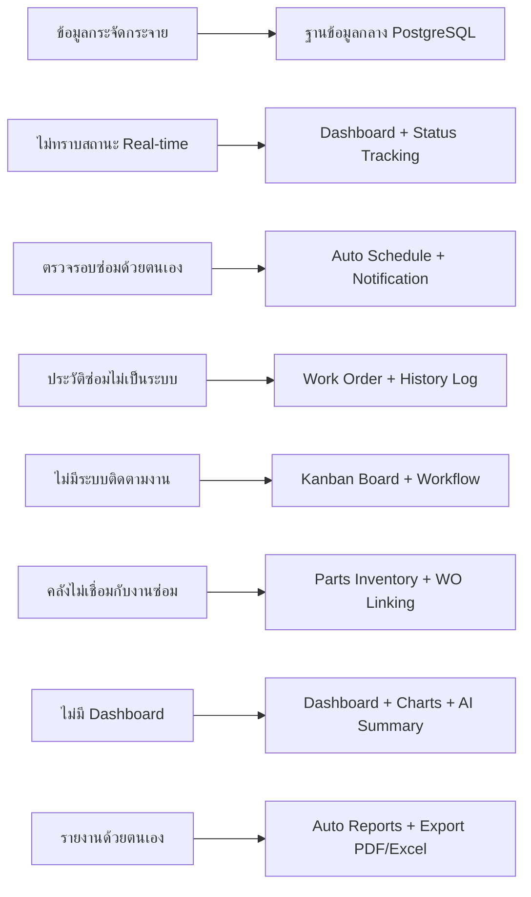
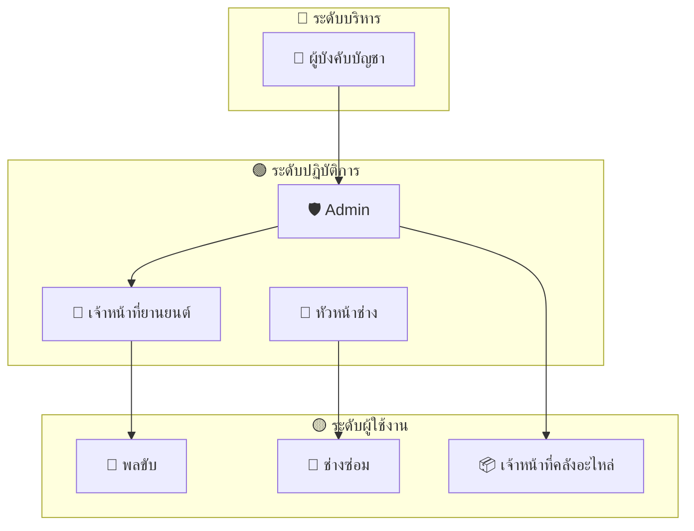
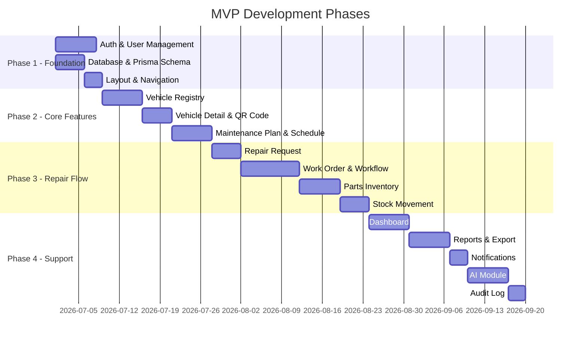
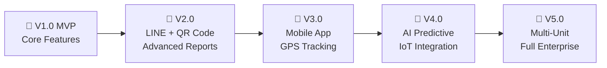

# 📋 Product Requirements Document (PRD)

## Smart Army Vehicle Maintenance Dashboard

### ระบบบริหารจัดการซ่อมบำรุงยานพาหนะอัจฉริยะสำหรับหน่วยงาน

---

> [!NOTE]
> **เวอร์ชันเอกสาร:** 1.0  
> **วันที่จัดทำ:** 14 มิถุนายน 2569  
> **สถานะ:** Draft  
> **ผู้จัดทำ:** ทีมพัฒนา — มหาวิทยาลัยราชภัฏยะลา

---

## สารบัญ

- [1. ข้อมูลโครงการ](#1-ข้อมูลโครงการ)
- [2. วิสัยทัศน์และภาพรวม](#2-วิสัยทัศน์และภาพรวม)
- [3. ที่มาของปัญหา](#3-ที่มาของปัญหา)
- [4. วัตถุประสงค์](#4-วัตถุประสงค์)
- [5. กลุ่มผู้ใช้งาน](#5-กลุ่มผู้ใช้งาน)
- [6. ขอบเขตของระบบ](#6-ขอบเขตของระบบ)
- [7. MVP Features](#7-mvp-features)
- [8. Success Criteria](#8-success-criteria)
- [9. Future Development](#9-future-development)

---

## 1. ข้อมูลโครงการ

| รายการ | รายละเอียด |
|--------|------------|
| **ชื่อโครงการ (EN)** | Smart Army Vehicle Maintenance Dashboard |
| **ชื่อโครงการ (TH)** | ระบบบริหารจัดการซ่อมบำรุงยานพาหนะอัจฉริยะสำหรับหน่วยงาน |
| **ประเภท** | Web Application (Full-stack) |
| **Platform** | Web-based, Responsive Design (Desktop + Mobile) |
| **Tech Stack หลัก** | Next.js, TypeScript, PostgreSQL, Prisma, Tailwind CSS, shadcn/ui |
| **AI Module** | Ollama + Gemma 2B/4B (Optional — Fallback to Rule-based) |
| **สถาบัน** | มหาวิทยาลัยราชภัฏยะลา |

---

## 2. วิสัยทัศน์และภาพรวม

### 2.1 วิสัยทัศน์ (Vision)

> *"สร้างระบบบริหารจัดการยานพาหนะและงานซ่อมบำรุงที่ครบวงจร ใช้งานง่าย และมี AI ช่วยวิเคราะห์ เพื่อให้หน่วยงานสามารถติดตามสถานะ ควบคุมค่าใช้จ่าย และรักษาความพร้อมของยานพาหนะได้อย่างมีประสิทธิภาพ"*

### 2.2 ภาพรวมโครงการ (Overview)

โครงการนี้เป็น **Web Application** สำหรับบริหารจัดการยานพาหนะและงานซ่อมบำรุงแบบครบวงจร ออกแบบในรูปแบบ **Dashboard** เพื่อให้เจ้าหน้าที่สามารถ:

- ✅ ตรวจสอบ**สถานะยานพาหนะ**ทั้งหมดจากหน้าจอเดียว
- ✅ จัดการ**การแจ้งซ่อม**และ**ใบงานซ่อม**อย่างเป็นระบบ
- ✅ ติดตาม**รอบการซ่อมบำรุง**ตามระยะเวลา / เลขไมล์ / ชั่วโมงเครื่องยนต์
- ✅ บริหาร**คลังอะไหล่** — รับเข้า เบิกออก แจ้งเตือนใกล้หมด
- ✅ สร้าง**รายงาน**สำหรับผู้ดูแลและผู้บังคับบัญชา
- ✅ ใช้ **AI** ช่วยสรุปประวัติซ่อม วิเคราะห์อาการเสีย และสร้างรายงานอัตโนมัติ

ระบบมุ่งเน้นการบริหารจัดการ**เชิงสนับสนุน** (Logistics & Maintenance Management) ไม่เกี่ยวข้องกับภารกิจทางยุทธวิธีหรือข้อมูลลับเฉพาะทาง

### 2.3 หลักการออกแบบ AI Module

```
┌─────────────────────────────────────────────────────┐
│              AI = ฟีเจอร์เสริม (Optional)            │
│                                                     │
│  • AI ช่วยสรุป วิเคราะห์ และให้คำแนะนำเบื้องต้น     │
│  • AI ไม่ใช่แกนหลักของระบบ                          │
│  • หาก AI ไม่พร้อม → ระบบหลักยังทำงานได้ปกติ         │
│  • ใช้ Rule-based Logic เป็น Fallback               │
│  • AI ไม่แก้ไขข้อมูลในฐานข้อมูลโดยตรง               │
└─────────────────────────────────────────────────────┘
```

---

## 3. ที่มาของปัญหา

ปัจจุบันการบริหารจัดการยานพาหนะในหน่วยงานประสบปัญหาหลายด้าน ทำให้ประสิทธิภาพในการดูแลรักษายานพาหนะต่ำกว่าที่ควรจะเป็น

### 3.1 ปัญหาที่พบ (8 ข้อ)

| # | ปัญหา | ผลกระทบ | ระดับ |
|---|--------|---------|-------|
| 1 | **ข้อมูลกระจัดกระจาย** — ข้อมูลยานพาหนะถูกจัดเก็บหลายที่ เช่น เอกสาร สมุดบันทึก หรือไฟล์ Excel | ค้นหายากและเสี่ยงต่อข้อมูลสูญหาย | 🔴 สูง |
| 2 | **ไม่ทราบสถานะรถแบบ Real-time** — เจ้าหน้าที่ไม่สามารถทราบสถานะรถแบบรวดเร็ว (พร้อมใช้งาน / กำลังซ่อม / รออะไหล่ / เกินรอบซ่อม) | การตัดสินใจล่าช้า ใช้เวลาสอบถามนาน | 🔴 สูง |
| 3 | **ตรวจสอบรอบซ่อมด้วยตนเอง** — การตรวจสอบรอบซ่อมบำรุงยังต้องอาศัยการจำหรือตรวจเอกสารด้วยตนเอง | พลาดรอบซ่อม ทำให้รถเสียก่อนกำหนด | 🟡 ปานกลาง |
| 4 | **ประวัติการซ่อมไม่เป็นระบบ** — ประวัติการซ่อมของรถแต่ละคันไม่ต่อเนื่อง | วิเคราะห์ปัญหาซ้ำหรือค่าใช้จ่ายสะสมได้ยาก | 🔴 สูง |
| 5 | **ไม่มีระบบติดตามงานซ่อม** — การแจ้งซ่อมและการมอบหมายงานช่างไม่มีระบบติดตามสถานะแบบเป็นขั้นตอน | งานซ่อมค้าง ไม่มีผู้รับผิดชอบชัดเจน | 🔴 สูง |
| 6 | **คลังอะไหล่ไม่เชื่อมกับงานซ่อม** — ไม่ทราบต้นทุนจริงของการซ่อมแต่ละครั้ง | ควบคุมงบประมาณไม่ได้ | 🟡 ปานกลาง |
| 7 | **ไม่มี Dashboard ภาพรวม** — ผู้ดูแลหรือผู้บังคับบัญชาไม่มี Dashboard สำหรับดูภาพรวมความพร้อมของยานพาหนะ | ขาดข้อมูลประกอบการตัดสินใจ | 🟡 ปานกลาง |
| 8 | **จัดทำรายงานด้วยตนเอง** — การจัดทำรายงานต้องรวบรวมข้อมูลด้วยตนเอง | เสียเวลาและอาจเกิดความผิดพลาด | 🟡 ปานกลาง |

### 3.2 Problem-Solution Mapping



---

## 4. วัตถุประสงค์

### 4.1 วัตถุประสงค์ของโครงการ (10 ข้อ)

| # | วัตถุประสงค์ | หมวดหมู่ |
|---|-------------|---------|
| 1 | เพื่อพัฒนาระบบ **Web Application** สำหรับบริหารจัดการข้อมูลยานพาหนะ | 🏗️ Development |
| 2 | เพื่อจัดเก็บข้อมูล**ทะเบียนรถ ประเภทรถ สถานะรถ** และเอกสารประจำรถอย่างเป็นระบบ | 📁 Data Management |
| 3 | เพื่อช่วยติดตาม**รอบการซ่อมบำรุง**ตามระยะเวลา เลขไมล์ หรือชั่วโมงเครื่องยนต์ | 🔧 Maintenance |
| 4 | เพื่อให้ผู้ใช้งานสามารถ**แจ้งซ่อม**และ**ติดตามสถานะ**งานซ่อมได้ | 📝 Repair Management |
| 5 | เพื่อให้ช่างสามารถจัดการ**ใบงานซ่อม** บันทึกอาการเสีย วิธีซ่อม และอะไหล่ที่ใช้ | 📋 Work Order |
| 6 | เพื่อบริหารจัดการ**คลังอะไหล่** — รับเข้า เบิกออก แจ้งเตือนใกล้หมด | 📦 Inventory |
| 7 | เพื่อสร้าง **Dashboard** แสดงภาพรวมสถานะยานพาหนะ งานซ่อม และค่าใช้จ่าย | 📊 Visualization |
| 8 | เพื่อสร้าง**รายงาน**สำหรับผู้ดูแลหรือผู้บังคับบัญชา | 📄 Reporting |
| 9 | เพื่อเพิ่มโมดูล **AI** สำหรับช่วยสรุป วิเคราะห์ และให้คำแนะนำเบื้องต้น | 🤖 AI Integration |
| 10 | เพื่อออกแบบระบบให้สามารถ**ขยายต่อในอนาคต**ได้ เช่น เปลี่ยน AI Model หรือแยก AI Server | 🚀 Scalability |

---

## 5. กลุ่มผู้ใช้งาน

### 5.1 สรุปผู้ใช้งาน (7 บทบาท)



### 5.2 รายละเอียดบทบาทผู้ใช้งาน

#### 🛡️ Role 1: Admin (ผู้ดูแลระบบ)

| รายการ | รายละเอียด |
|--------|------------|
| **บทบาท** | ผู้ดูแลระบบ — Super Admin |
| **หน้าที่หลัก** | จัดการข้อมูลพื้นฐานทั้งหมด |
| **สิทธิ์การเข้าถึง** | เข้าถึงทุกเมนูในระบบ |
| **ตัวอย่างงาน** | จัดการผู้ใช้งาน, สิทธิ์, หน่วยงาน, ประเภทรถ, การตั้งค่าระบบ |

#### 🚗 Role 2: เจ้าหน้าที่ยานยนต์

| รายการ | รายละเอียด |
|--------|------------|
| **บทบาท** | ผู้ดูแลยานพาหนะของหน่วยงาน |
| **หน้าที่หลัก** | ลงทะเบียนรถ, ตรวจสอบสถานะ, จัดการรอบซ่อม, รับเรื่องแจ้งซ่อม |
| **สิทธิ์การเข้าถึง** | Vehicles, Maintenance, Repair Requests, Dashboard |
| **ตัวอย่างงาน** | เพิ่มรถใหม่, ตรวจสอบรถใกล้ถึงรอบซ่อม, รับเรื่องแจ้งซ่อม |

#### 🚙 Role 3: พลขับ (ผู้ใช้งานรถ)

| รายการ | รายละเอียด |
|--------|------------|
| **บทบาท** | ผู้ขับขี่ยานพาหนะ |
| **หน้าที่หลัก** | ตรวจสภาพก่อนใช้งาน, อัปเดตเลขไมล์, แจ้งปัญหาหรืออาการเสีย |
| **สิทธิ์การเข้าถึง** | Inspection, Repair Request (สร้าง), Dashboard (จำกัด) |
| **ตัวอย่างงาน** | ตรวจรถก่อนออก, แจ้งซ่อมเมื่อรถมีปัญหา, อัปเดตเลขไมล์หลังใช้งาน |

#### 🔧 Role 4: ช่างซ่อม

| รายการ | รายละเอียด |
|--------|------------|
| **บทบาท** | ผู้ดำเนินการซ่อมบำรุง |
| **หน้าที่หลัก** | รับใบงานซ่อม, ตรวจสอบอาการเสีย, บันทึกวิธีซ่อม, ขอเบิกอะไหล่ |
| **สิทธิ์การเข้าถึง** | Work Orders (อัปเดต), Parts (ขอเบิก) |
| **ตัวอย่างงาน** | วินิจฉัยอาการเสีย, เบิกอะไหล่, อัปเดตสถานะงาน, แนบรูปก่อน/หลังซ่อม |

#### 👷 Role 5: หัวหน้าช่าง

| รายการ | รายละเอียด |
|--------|------------|
| **บทบาท** | หัวหน้าทีมซ่อมบำรุง |
| **หน้าที่หลัก** | มอบหมายงานให้ช่าง, ตรวจสอบความคืบหน้า, อนุมัติชิ้นส่วน, ตรวจคุณภาพ |
| **สิทธิ์การเข้าถึง** | Work Orders (จัดการ), Parts (อนุมัติบางส่วน), Maintenance (จัดการ) |
| **ตัวอย่างงาน** | มอบหมายช่าง, ตรวจคุณภาพก่อนปิดงาน, อนุมัติการใช้อะไหล่ |

#### 📦 Role 6: เจ้าหน้าที่คลังอะไหล่

| รายการ | รายละเอียด |
|--------|------------|
| **บทบาท** | ผู้ดูแลคลังอะไหล่ |
| **หน้าที่หลัก** | จัดการข้อมูลอะไหล่, รับอะไหล่เข้า, เบิกอะไหล่ออก, ปรับยอดสต็อก |
| **สิทธิ์การเข้าถึง** | Parts (จัดการ), Stock Movements |
| **ตัวอย่างงาน** | รับอะไหล่เข้าคลัง, อนุมัติการเบิก, ตรวจสอบอะไหล่ใกล้หมด |

#### 👔 Role 7: ผู้บังคับบัญชา (ผู้บริหาร)

| รายการ | รายละเอียด |
|--------|------------|
| **บทบาท** | ผู้บริหาร — ดูภาพรวมและอนุมัติ |
| **หน้าที่หลัก** | ดู Dashboard, รายงานภาพรวม, ความพร้อมของยานพาหนะ, ค่าใช้จ่าย |
| **สิทธิ์การเข้าถึง** | Dashboard (ดูทั้งหมด), Reports (ดูทั้งหมด), Audit Logs (ดูบางส่วน) |
| **ตัวอย่างงาน** | ดูรายงานสรุปประจำเดือน, ตรวจสอบภาพรวมค่าใช้จ่าย, อนุมัติรายการสำคัญ |

### 5.3 Permission Matrix

| Module | Admin | เจ้าหน้าที่ยานยนต์ | พลขับ | ช่าง | หัวหน้าช่าง | คลังอะไหล่ | ผู้บังคับบัญชา |
|--------|-------|---------------------|-------|------|-------------|------------|----------------|
| Dashboard | ดู | ดู | จำกัด | จำกัด | ดู | จำกัด | ดูทั้งหมด |
| Vehicles | จัดการ | จัดการ | ดูบางส่วน | ดู | ดู | ดู | ดู |
| Inspections | ดู | ดู | สร้าง | ดู | ดู | - | ดู |
| Maintenance | จัดการ | จัดการ | ดู | ดู | จัดการ | - | ดู |
| Repair Requests | จัดการ | จัดการ | สร้าง | ดู | ดู | - | ดู |
| Work Orders | จัดการ | ดู | ดูของตน | อัปเดต | จัดการ | ดู | ดู |
| Parts | จัดการ | ดู | - | ขอเบิก | อนุมัติบางส่วน | จัดการ | ดู |
| Reports | ดูทั้งหมด | ดู | จำกัด | จำกัด | ดู | ดู | ดูทั้งหมด |
| Users | จัดการ | - | - | - | - | - | - |
| Audit Logs | ดู | - | - | - | - | - | ดูบางส่วน |

---

## 6. ขอบเขตของระบบ

### 6.1 ขอบเขตที่ระบบต้องทำ (In Scope — 16 ฟีเจอร์)

| # | ฟีเจอร์ | คำอธิบาย | Priority |
|---|---------|---------|----------|
| 1 | **ระบบเข้าสู่ระบบและจัดการสิทธิ์ผู้ใช้** | Login, Logout, RBAC, จัดการผู้ใช้ | 🔴 Must |
| 2 | **Dashboard ภาพรวม** | Summary Cards, Charts, Tables | 🔴 Must |
| 3 | **ระบบลงทะเบียนยานพาหนะ** | CRUD ข้อมูลรถ, ค้นหา, กรอง | 🔴 Must |
| 4 | **ระบบจัดการประเภทยานพาหนะ** | CRUD ประเภทรถ | 🟡 Should |
| 5 | **ระบบ QR Code ประจำรถ** | สร้าง/ดาวน์โหลด QR Code | 🟡 Should |
| 6 | **ระบบตรวจสภาพก่อนใช้งาน** | Checklist, ผลตรวจ, Auto Repair Request | 🔴 Must |
| 7 | **ระบบรอบซ่อมบำรุง** | แผนซ่อม, คำนวณรอบ, แจ้งเตือน | 🔴 Must |
| 8 | **ระบบแจ้งซ่อม** | สร้าง/ติดตาม Repair Request | 🔴 Must |
| 9 | **ระบบใบงานซ่อม** | Work Order, Workflow, Kanban Board | 🔴 Must |
| 10 | **ระบบจัดการอะไหล่** | CRUD อะไหล่, หมวดหมู่, ผู้จำหน่าย | 🔴 Must |
| 11 | **ระบบเบิกอะไหล่และรับอะไหล่เข้า** | Stock In/Out, ผูกกับ Work Order | 🔴 Must |
| 12 | **ระบบแจ้งเตือน** | In-app Notifications, Email | 🟡 Should |
| 13 | **ระบบรายงาน** | 12 รายงาน, Export PDF/Excel/CSV | 🔴 Must |
| 14 | **ระบบแนบไฟล์และรูปภาพ** | Upload ไฟล์, เชื่อมกับข้อมูล | 🟡 Should |
| 15 | **ระบบ Audit Log** | บันทึกการกระทำสำคัญ | 🟡 Should |
| 16 | **ระบบ AI ช่วยสรุปและวิเคราะห์** | AI Summary, AI Analysis, Fallback | 🟢 Nice-to-have |

### 6.2 ขอบเขตที่ไม่ทำในเวอร์ชันแรก (Out of Scope — 10 รายการ)

> [!WARNING]
> สิ่งต่อไปนี้อยู่นอกขอบเขตของเวอร์ชันแรก เพื่อควบคุมขนาดของโครงงาน

| # | รายการ | เหตุผลที่ไม่ทำ |
|---|--------|---------------|
| 1 | **ระบบ GPS Tracking แบบ Real-time** | ต้องการ Hardware เพิ่มเติม |
| 2 | **ระบบ IoT ติดตั้งบนรถจริง** | ต้องการ Sensor และ Firmware |
| 3 | **ระบบจองรถแบบเต็มรูปแบบ** | ขอบเขตใหญ่เกินไป |
| 4 | **ระบบจัดซื้อจัดจ้างแบบเต็มรูปแบบ** | เกี่ยวข้องกับระบบบัญชี |
| 5 | **ระบบชำระเงิน** | ไม่จำเป็นสำหรับหน่วยงานราชการ |
| 6 | **การ Train หรือ Fine-tune AI Model เอง** | ซับซ้อนเกินไปสำหรับ MVP |
| 7 | **การให้ AI เข้าถึงฐานข้อมูลโดยตรง** | ความปลอดภัย |
| 8 | **ระบบ Mobile App แบบ Native** | ใช้ Responsive Web แทน |
| 9 | **ระบบบริหารภารกิจทางยุทธวิธี** | นอกขอบเขตงานสนับสนุน |
| 10 | **ระบบเกี่ยวกับอาวุธหรือข้อมูลลับเฉพาะทาง** | ด้านความปลอดภัย |

---

## 7. MVP Features

> [!IMPORTANT]
> MVP (Minimum Viable Product) คือเวอร์ชันแรกที่ต้องทำให้เสร็จจริง มี 15 ฟีเจอร์หลัก

### 7.1 รายการ MVP Features (15 ฟีเจอร์)

| # | ฟีเจอร์ | รายละเอียด | Complexity |
|---|---------|------------|------------|
| 1 | **Login และ Role** | เข้าสู่ระบบ, ออกจากระบบ, RBAC | ⭐⭐ |
| 2 | **Dashboard** | Summary Cards, Charts, Tables | ⭐⭐⭐ |
| 3 | **Vehicle Registry** | CRUD ข้อมูลรถ, ค้นหา, กรอง | ⭐⭐⭐ |
| 4 | **Vehicle Detail** | หน้ารายละเอียดรถ, ประวัติซ่อม, QR Code | ⭐⭐⭐ |
| 5 | **Maintenance Plan** | สร้าง/แก้ไขแผนซ่อมบำรุง | ⭐⭐ |
| 6 | **Maintenance Schedule** | คำนวณรอบซ่อม, แจ้งเตือน | ⭐⭐⭐ |
| 7 | **Repair Request** | สร้าง/ติดตามใบแจ้งซ่อม | ⭐⭐ |
| 8 | **Work Order** | ใบงานซ่อม, Workflow, Kanban Board | ⭐⭐⭐⭐ |
| 9 | **Parts Inventory** | CRUD อะไหล่, ค้นหา, กรอง | ⭐⭐⭐ |
| 10 | **Stock Movement** | รับเข้า/เบิกออก อะไหล่ | ⭐⭐⭐ |
| 11 | **Notification พื้นฐาน** | In-app Notification | ⭐⭐ |
| 12 | **Report พื้นฐาน** | รายงานหลัก, Export PDF/Excel | ⭐⭐⭐ |
| 13 | **AI Summary** | สรุปประวัติซ่อมด้วย AI | ⭐⭐ |
| 14 | **AI Issue Classification** | วิเคราะห์อาการเสียด้วย AI | ⭐⭐ |
| 15 | **Audit Log พื้นฐาน** | บันทึกการกระทำสำคัญ | ⭐⭐ |

### 7.2 MVP Release Phases



---

## 8. Success Criteria

> [!IMPORTANT]
> ระบบถือว่าประสบความสำเร็จเมื่อผ่านเกณฑ์ทั้ง 14 ข้อต่อไปนี้

### 8.1 เกณฑ์ความสำเร็จ (14 ข้อ)

| # | เกณฑ์ | หมวด | วิธีทดสอบ |
|---|-------|------|----------|
| 1 | ผู้ใช้สามารถ **Login** และใช้งานตามสิทธิ์ได้ | Auth | Login ด้วย 7 Role แล้วตรวจสอบเมนูที่เห็น |
| 2 | Admin สามารถ**จัดการข้อมูลรถ**ได้ | Vehicle | เพิ่ม/แก้ไข/ลบ/ค้นหารถ |
| 3 | ระบบสามารถแสดง **Dashboard ภาพรวม**ได้ | Dashboard | เปิดหน้า Dashboard ตรวจสอบ Cards + Charts |
| 4 | ระบบสามารถ**แจ้งเตือนรถใกล้ถึงรอบซ่อม**ได้ | Maintenance | สร้างรอบซ่อมแล้วตรวจสอบ Notification |
| 5 | ผู้ใช้สามารถ**แจ้งซ่อม**ได้ | Repair | สร้าง Repair Request แนบรูป |
| 6 | ช่างสามารถ**จัดการใบงานซ่อม**ได้ | Work Order | รับงาน, อัปเดตสถานะ, บันทึกวิธีซ่อม |
| 7 | ระบบสามารถ**บันทึกอะไหล่ที่ใช้**ในงานซ่อมได้ | Parts | เบิกอะไหล่ใน Work Order |
| 8 | ระบบสามารถ**ตัดสต็อกอะไหล่**ได้ | Inventory | เบิกอะไหล่แล้วตรวจจำนวนคงเหลือ |
| 9 | ระบบสามารถแสดง**รายงานพื้นฐาน**ได้ | Report | เปิดหน้ารายงานตรวจสอบข้อมูล |
| 10 | ระบบสามารถ **Export รายงาน**ได้ | Report | Export PDF, Excel, CSV |
| 11 | **AI สามารถสรุปประวัติซ่อม**ได้ | AI | กดปุ่ม AI Summary ในหน้ารถ |
| 12 | หาก **AI ไม่พร้อมใช้งาน** ระบบหลักยังทำงานได้ | AI Fallback | ปิด Ollama แล้วทดสอบ |
| 13 | ระบบสามารถ**ใช้งานผ่านมือถือ**ได้ | Mobile | ทดสอบ Responsive บน Chrome DevTools |
| 14 | ระบบมี **Audit Log** สำหรับตรวจสอบย้อนหลัง | Audit | ดู Log หลังทำ action ต่าง ๆ |

---

## 9. Future Development

### 9.1 ฟีเจอร์ที่สามารถพัฒนาต่อในอนาคต (12 รายการ)

| # | ฟีเจอร์ | รายละเอียด | Priority |
|---|---------|------------|----------|
| 1 | **Mobile App แบบ Native** | React Native / Flutter | 🟡 |
| 2 | **GPS Tracking** | ติดตามตำแหน่งรถ Real-time | 🟡 |
| 3 | **IoT Sensor เชื่อมกับรถ** | เซ็นเซอร์วัดค่าต่าง ๆ อัตโนมัติ | 🟢 |
| 4 | **ระบบจองรถ** | จองรถล่วงหน้า, ตารางการใช้งาน | 🟡 |
| 5 | **ระบบจัดซื้ออะไหล่** | Procurement, PO, Invoice | 🟡 |
| 6 | **LINE Messaging API** | แจ้งเตือนผ่าน LINE OA | 🔴 |
| 7 | **ระบบอนุมัติหลายระดับ** | Multi-level Approval Workflow | 🟡 |
| 8 | **AI Predictive Maintenance ขั้นสูง** | ทำนายการเสียล่วงหน้าจาก pattern | 🟢 |
| 9 | **AI Chat Assistant** | ถาม AI เกี่ยวกับข้อมูลในระบบ | 🟢 |
| 10 | **Power BI / Looker Studio** | เชื่อมต่อ BI Tools | 🟡 |
| 11 | **Multi-branch / Multi-unit** | รองรับหลายหน่วยงาน | 🟡 |
| 12 | **Backup & Disaster Recovery** | ระบบสำรองข้อมูลเต็มรูปแบบ | 🔴 |

### 9.2 Roadmap ระยะยาว



---

> [!TIP]
> เอกสาร PRD ฉบับนี้ใช้เป็นแนวทางหลักในการพัฒนา สามารถปรับปรุงได้ตามความเหมาะสมระหว่างการพัฒนา

---

*สิ้นสุดเอกสาร PRD — Smart Army Vehicle Maintenance Dashboard*
