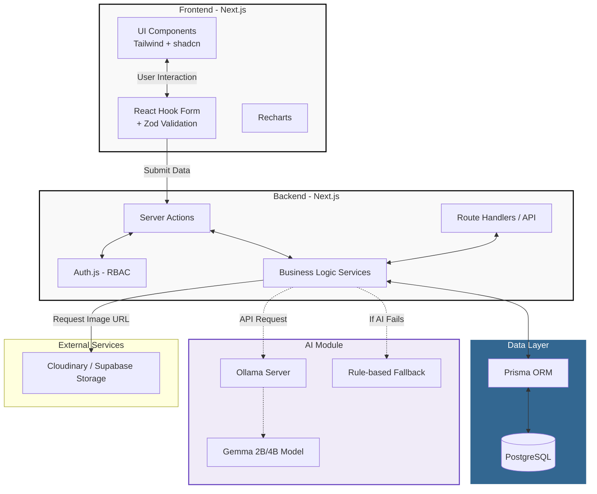

# 🏗️ Tech Stack & Architecture

## Smart Army Vehicle Maintenance Dashboard

---

## 1. Tech Stack (เทคโนโลยีที่ใช้)

### 1.1 Frontend
- **Framework:** Next.js (App Router)
- **Language:** TypeScript
- **Styling:** Tailwind CSS
- **UI Components:** shadcn/ui
- **Icons:** Lucide React
- **Charts:** Recharts
- **Forms:** React Hook Form
- **Validation:** Zod

### 1.2 Backend
- **Framework:** Next.js Server Actions & Route Handlers
- **Language:** TypeScript
- **ORM:** Prisma ORM
- **Database:** PostgreSQL

### 1.3 Authentication & Authorization
- **Auth Provider:** Auth.js (NextAuth.js)
- **Session:** Session-based Authentication
- **Access Control:** Role-Based Access Control (RBAC)

### 1.4 AI Module
- **Engine:** Ollama
- **Model:** Gemma (2B หรือ 4B)
- **Integration:** AI Service API ภายใน Next.js
- **Fallback:** Rule-based Logic (ทำงานเมื่อ AI ไม่พร้อม)

### 1.5 Storage & Deployment
- **File Storage:** Cloudinary หรือ Supabase Storage (สำหรับรูปภาพและเอกสาร)
- **Frontend Hosting:** Vercel
- **Database Hosting:** Supabase หรือ Neon (PostgreSQL)

---

## 2. Architecture Diagram



---

## 3. Directory Structure

โครงสร้างโฟลเดอร์สำหรับโปรเจกต์ Next.js (App Router):

```text
smart-vehicle-maintenance/
├── app/                      # Next.js App Router (Pages & Layouts)
│   ├── (auth)/               # กลุ่มหน้า Auth (Login)
│   ├── (dashboard)/          # กลุ่มหน้า Dashboard
│   │   ├── dashboard/        # หน้า Dashboard หลัก
│   │   ├── vehicles/         # ระบบทะเบียนรถ
│   │   ├── inspections/      # ระบบตรวจสภาพรถ
│   │   ├── work-orders/      # ระบบใบงานซ่อม
│   │   ├── parts/            # ระบบคลังอะไหล่
│   │   └── ...               # หน้าอื่นๆ
│   ├── api/                  # Route Handlers (API Endpoints)
│   ├── layout.tsx            # Root Layout
│   └── page.tsx              # Landing Page
├── components/               # React Components
│   ├── ui/                   # shadcn/ui components
│   ├── layout/               # Header, Sidebar, Footer
│   ├── dashboard/            # Components เฉพาะหน้า Dashboard
│   ├── vehicles/             # Components เกี่ยวกับยานพาหนะ
│   └── shared/               # Components ที่ใช้ร่วมกันหลายที่
├── lib/                      # Library configs
│   ├── prisma.ts             # Prisma Client instance
│   ├── auth.ts               # Auth.js config
│   └── utils.ts              # Utility functions (cn, etc.)
├── services/                 # Business Logic (เรียกใช้จาก Server Actions/API)
│   ├── vehicle.service.ts
│   ├── repair.service.ts
│   ├── ai.service.ts
│   └── ...
├── actions/                  # Next.js Server Actions
│   ├── vehicle.actions.ts
│   ├── repair.actions.ts
│   └── ...
├── types/                    # TypeScript interfaces & types
│   ├── index.ts
│   ├── vehicle.ts
│   └── ...
├── prisma/                   # Prisma schema & migrations
│   ├── schema.prisma
│   └── seed.ts               # Seed data
├── public/                   # Static assets (images, fonts)
└── styles/                   # Global CSS (globals.css)
```

---

## 4. Key Design Decisions

1. **Server Actions vs Route Handlers**: เน้นใช้ Server Actions สำหรับฟอร์มและ Data Mutation เพื่อลด Boilerplate API และใช้ Route Handlers สำหรับ Webhook, AI Service, หรือ API ที่ต้องการเปิดให้ระบบอื่นเรียก
2. **Prisma ORM**: เลือกใช้ Prisma เพราะ Type Safety สูงมาก ทำงานร่วมกับ TypeScript ได้อย่างไร้รอยต่อ และจัดการ Migration ได้ง่าย
3. **shadcn/ui**: ใช้เป็นฐานสำหรับ UI Components เพื่อความรวดเร็วและสามารถปรับแต่ง (Customize) ได้เต็มที่โดยไม่ติดข้อจำกัดแบบ Component Library ทั่วไป
4. **Zod + React Hook Form**: การตรวจสอบความถูกต้อง (Validation) ใช้ Zod ทั้งฝั่ง Client และ Server เพื่อความปลอดภัยสูงสุด
