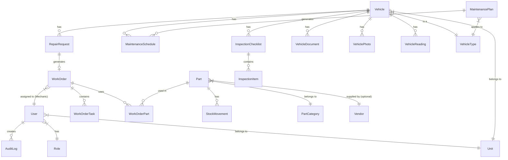

# 🗄️ Database Schema

## Smart Army Vehicle Maintenance Dashboard

เอกสารนี้อธิบายโครงสร้างฐานข้อมูล (Database Schema) ทั้ง 25 ตารางที่ใช้ในระบบ

---

## 1. ER Diagram

---

## 2. โครงสร้างตาราง (Tables)

### 2.1 Users & Authentication

**1. users** (ข้อมูลผู้ใช้งาน)
- `id` (UUID, PK)
- `email` (String, Unique)
- `password` (String)
- `name` (String)
- `role_id` (UUID, FK -> roles.id)
- `unit_id` (UUID, FK -> units.id, Nullable)
- `status` (Enum: ACTIVE, INACTIVE)
- `created_at` (DateTime)
- `updated_at` (DateTime)

**2. roles** (บทบาทผู้ใช้งาน)
- `id` (UUID, PK)
- `name` (String) - เช่น Admin, ช่างซ่อม, พลขับ
- `description` (String, Nullable)

**3. permissions** (สิทธิ์การใช้งานระบบ)
- `id` (UUID, PK)
- `role_id` (UUID, FK -> roles.id)
- `module` (String) - เช่น vehicles, work_orders
- `action` (String) - เช่น create, read, update, delete

**4. units** (หน่วยงาน)
- `id` (UUID, PK)
- `name` (String)
- `description` (String, Nullable)

### 2.2 Vehicles Management

**5. vehicles** (ยานพาหนะ)
- `id` (UUID, PK)
- `registration_number` (String, Unique) - ทะเบียนรถ
- `fleet_number` (String, Unique, Nullable) - รหัสครุภัณฑ์/รหัสประจำรถ
- `vin` (String, Unique, Nullable) - เลขตัวถัง
- `engine_number` (String, Unique, Nullable) - เลขเครื่องยนต์
- `vehicle_type_id` (UUID, FK -> vehicle_types.id)
- `brand` (String)
- `model` (String)
- `year` (Int)
- `unit_id` (UUID, FK -> units.id)
- `fuel_type` (String)
- `current_mileage` (Float)
- `engine_hours` (Float, Nullable)
- `status` (Enum: AVAILABLE, IN_USE, DUE_SOON, OVERDUE, IN_REPAIR, WAITING_PARTS, OUT_OF_SERVICE, RETIRED)

**6. vehicle_types** (ประเภทยานพาหนะ)
- `id` (UUID, PK)
- `name` (String) - เช่น รถกระบะ, รถบรรทุก

**7. vehicle_documents** (เอกสารประจำรถ)
- `id` (UUID, PK)
- `vehicle_id` (UUID, FK -> vehicles.id)
- `document_type` (String) - เช่น พรบ, ทะเบียน, ประกัน
- `file_url` (String)
- `expiry_date` (DateTime, Nullable)

**8. vehicle_photos** (รูปภาพรถ)
- `id` (UUID, PK)
- `vehicle_id` (UUID, FK -> vehicles.id)
- `photo_url` (String)
- `is_primary` (Boolean)

**9. vehicle_readings** (ประวัติการบันทึกเลขไมล์)
- `id` (UUID, PK)
- `vehicle_id` (UUID, FK -> vehicles.id)
- `reading_value` (Float)
- `reading_type` (Enum: MILEAGE, HOURS)
- `recorded_at` (DateTime)
- `recorded_by` (UUID, FK -> users.id)

### 2.3 Inspections

**10. inspection_checklists** (การตรวจสภาพรถ)
- `id` (UUID, PK)
- `vehicle_id` (UUID, FK -> vehicles.id)
- `inspector_id` (UUID, FK -> users.id)
- `inspection_date` (DateTime)
- `mileage` (Float)
- `result` (Enum: PASS, MINOR_ISSUES, FAIL)
- `remarks` (String, Nullable)

**11. inspection_items** (รายการตรวจสภาพ)
- `id` (UUID, PK)
- `checklist_id` (UUID, FK -> inspection_checklists.id)
- `item_name` (String)
- `status` (Enum: PASS, FAIL)
- `remarks` (String, Nullable)
- `photo_url` (String, Nullable)

### 2.4 Maintenance

**12. maintenance_plans** (แผนการซ่อมบำรุง)
- `id` (UUID, PK)
- `name` (String)
- `vehicle_type_id` (UUID, FK -> vehicle_types.id)
- `interval_months` (Int, Nullable)
- `interval_mileage` (Float, Nullable)
- `interval_hours` (Float, Nullable)

**13. maintenance_schedules** (รอบการซ่อมบำรุงของรถแต่ละคัน)
- `id` (UUID, PK)
- `vehicle_id` (UUID, FK -> vehicles.id)
- `plan_id` (UUID, FK -> maintenance_plans.id)
- `last_performed_date` (DateTime, Nullable)
- `last_performed_mileage` (Float, Nullable)
- `next_due_date` (DateTime, Nullable)
- `next_due_mileage` (Float, Nullable)
- `status` (Enum: PENDING, DUE_SOON, OVERDUE, COMPLETED)

### 2.5 Repairs & Work Orders

**14. repair_requests** (ใบแจ้งซ่อม)
- `id` (UUID, PK)
- `request_number` (String, Unique)
- `vehicle_id` (UUID, FK -> vehicles.id)
- `requester_id` (UUID, FK -> users.id)
- `symptoms` (String)
- `system_category` (String)
- `urgency` (Enum: LOW, MEDIUM, HIGH, EMERGENCY)
- `mileage` (Float)
- `status` (Enum: PENDING, ACKNOWLEDGED, APPROVED, WORK_ORDER_CREATED, REJECTED)
- `photo_url` (String, Nullable)

**15. work_orders** (ใบงานซ่อม)
- `id` (UUID, PK)
- `wo_number` (String, Unique)
- `repair_request_id` (UUID, FK -> repair_requests.id, Nullable)
- `vehicle_id` (UUID, FK -> vehicles.id)
- `mechanic_id` (UUID, FK -> users.id, Nullable)
- `supervisor_id` (UUID, FK -> users.id)
- `status` (Enum: OPEN, PENDING_APPROVAL, ASSIGNED, DIAGNOSING, WAITING_PARTS, IN_PROGRESS, READY_FOR_QC, COMPLETED, CLOSED, CANCELLED)
- `start_date` (DateTime, Nullable)
- `end_date` (DateTime, Nullable)
- `total_labor_cost` (Float)
- `total_parts_cost` (Float)

**16. work_order_tasks** (รายการที่ซ่อมในใบงาน)
- `id` (UUID, PK)
- `work_order_id` (UUID, FK -> work_orders.id)
- `task_description` (String)
- `labor_hours` (Float)
- `cost` (Float)

### 2.6 Parts & Inventory

**17. parts** (อะไหล่)
- `id` (UUID, PK)
- `part_number` (String, Unique)
- `name` (String)
- `category_id` (UUID, FK -> part_categories.id)
- `stock_quantity` (Int)
- `minimum_quantity` (Int)
- `unit_measure` (String)
- `unit_price` (Float)
- `vendor_id` (UUID, FK -> vendors.id, Nullable)

**18. part_categories** (หมวดหมู่อะไหล่)
- `id` (UUID, PK)
- `name` (String)

**19. stock_movements** (ประวัติการเข้า-ออกของอะไหล่)
- `id` (UUID, PK)
- `part_id` (UUID, FK -> parts.id)
- `movement_type` (Enum: IN, OUT, ADJUSTMENT)
- `quantity` (Int)
- `reference_id` (String, Nullable) - เช่น WO number
- `performed_by` (UUID, FK -> users.id)
- `date` (DateTime)

**20. work_order_parts** (อะไหล่ที่ใช้ในใบงานซ่อม)
- `id` (UUID, PK)
- `work_order_id` (UUID, FK -> work_orders.id)
- `part_id` (UUID, FK -> parts.id)
- `quantity` (Int)
- `unit_price` (Float)
- `total_price` (Float)

**21. vendors** (ผู้จำหน่าย)
- `id` (UUID, PK)
- `name` (String)
- `contact_info` (String, Nullable)

### 2.7 System Support

**22. notifications** (การแจ้งเตือน)
- `id` (UUID, PK)
- `user_id` (UUID, FK -> users.id)
- `title` (String)
- `message` (String)
- `type` (String)
- `is_read` (Boolean, Default: false)
- `created_at` (DateTime)

**23. attachments** (ไฟล์แนบทั่วไป)
- `id` (UUID, PK)
- `entity_type` (String) - เช่น WorkOrder, RepairRequest
- `entity_id` (UUID)
- `file_url` (String)
- `file_name` (String)
- `uploaded_by` (UUID, FK -> users.id)

**24. ai_logs** (ประวัติการใช้งาน AI)
- `id` (UUID, PK)
- `user_id` (UUID, FK -> users.id)
- `action` (String) - เช่น summarize_repair, analyze_issue
- `prompt` (Text)
- `response` (Text)
- `created_at` (DateTime)

**25. audit_logs** (ประวัติการกระทำในระบบ)
- `id` (UUID, PK)
- `user_id` (UUID, FK -> users.id)
- `action` (String)
- `entity_type` (String)
- `entity_id` (UUID)
- `old_values` (JSON, Nullable)
- `new_values` (JSON, Nullable)
- `ip_address` (String, Nullable)
- `created_at` (DateTime)
