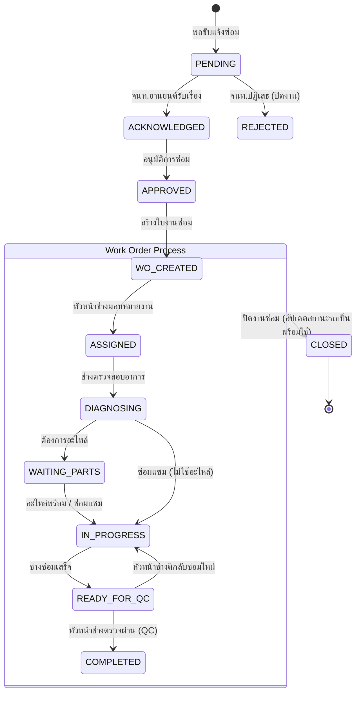
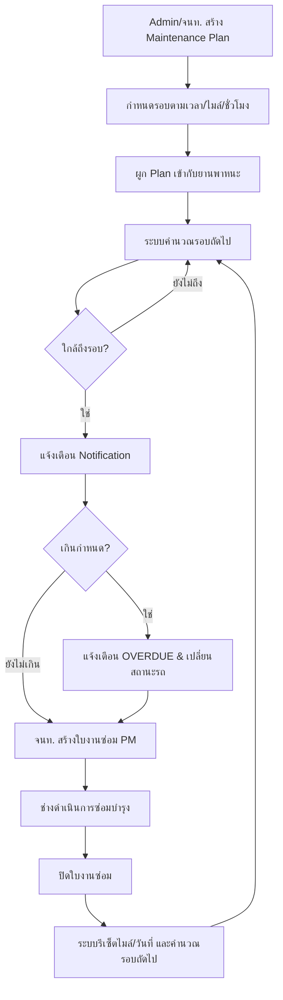
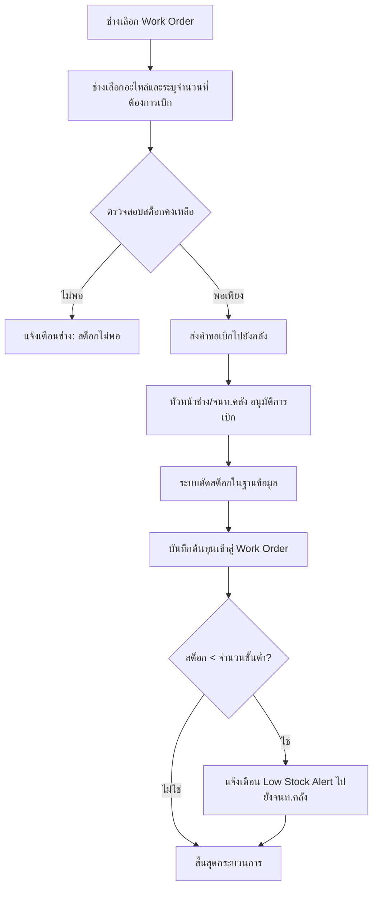

# 🔄 Workflow Diagrams

## Smart Army Vehicle Maintenance Dashboard

---

## Workflow 1: การแจ้งซ่อมและการจัดการใบงาน (Repair Request to Work Order)



---

## Workflow 2: รอบการซ่อมบำรุง (Maintenance Schedule Flow)



---

## Workflow 3: การเบิกอะไหล่ (Parts Requisition Flow)



---

## Workflow 4: ระบบวิเคราะห์อาการเสียด้วย AI (AI Analysis Flow)

```mermaid
flowchart TD
    A[ผู้ใช้พิมพ์อาการเสีย] --> B[กดปุ่ม 'วิเคราะห์ด้วย AI']
    B --> C{AI Server (Ollama) พร้อมใช้งาน?}
    
    C -->|Yes| D[ส่ง Prompt + อาการเสียไปให้ Gemma]
    D --> E[Gemma ประมวลผล]
    E --> F[ระบบดึงหมวดหมู่และความเร่งด่วนออกมา]
    F --> G[แสดงผลให้ผู้ใช้ทราบ]
    
    C -->|No| H[Fallback: จับ Keyword ด้วย Rule-based]
    H --> I[ถ้าเจอคำว่า 'เบรก' ให้ตั้งเป็น 'ระบบเบรก, เร่งด่วน']
    I --> G
    
    G --> J[ผู้ใช้สามารถแก้ไขค่าที่ระบบแนะนำได้ก่อนบันทึก]
```
