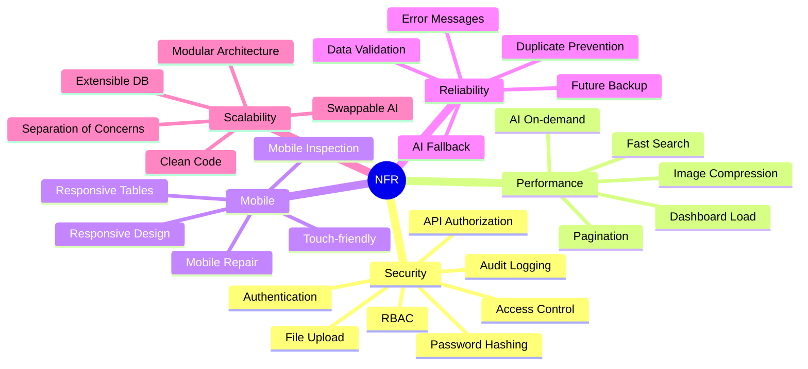
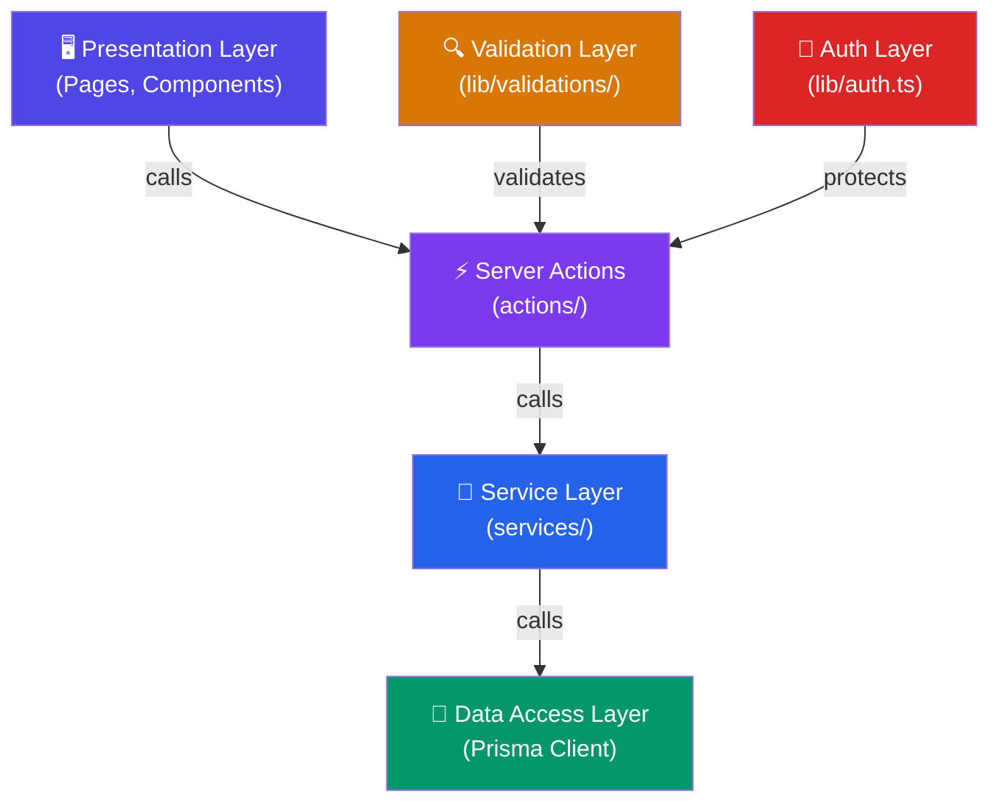

# 📋 Non-Functional Requirements (NFR)

> **Smart Army Vehicle Maintenance Dashboard**
> เอกสารข้อกำหนดที่ไม่ใช่เชิงฟังก์ชัน (Non-Functional Requirements)
> Version 1.0 | Last Updated: 2026-06-14

---

## สารบัญ

- [ภาพรวม](#ภาพรวม)
- [NFR-01: Security (ความปลอดภัย)](#nfr-01-security-ความปลอดภัย)
- [NFR-02: Performance (ประสิทธิภาพ)](#nfr-02-performance-ประสิทธิภาพ)
- [NFR-03: Mobile Responsiveness (การตอบสนองบนมือถือ)](#nfr-03-mobile-responsiveness-การตอบสนองบนมือถือ)
- [NFR-04: Reliability (ความน่าเชื่อถือ)](#nfr-04-reliability-ความน่าเชื่อถือ)
- [NFR-05: Scalability (ความสามารถในการขยาย)](#nfr-05-scalability-ความสามารถในการขยาย)
- [สรุปภาพรวม NFR ทั้งหมด](#สรุปภาพรวม-nfr-ทั้งหมด)

---

## ภาพรวม

เอกสารฉบับนี้กำหนดข้อกำหนดที่ไม่ใช่เชิงฟังก์ชัน (Non-Functional Requirements) ของระบบ Smart Army Vehicle Maintenance Dashboard ครอบคลุม 5 หมวดหมู่หลัก รวมทั้งสิ้น **27 ข้อกำหนด** ที่ระบบต้องตอบสนองเพื่อให้มั่นใจว่าระบบมีคุณภาพ ปลอดภัย และพร้อมใช้งานในระดับ Production

### Priority Levels

| Priority | คำอธิบาย | ความหมาย |
|----------|---------|-----------|
| **Must** | ต้องมี (Required) | ระบบจะไม่สามารถ deploy ได้หากขาดข้อกำหนดนี้ |
| **Should** | ควรมี (Recommended) | สำคัญต่อคุณภาพของระบบ แต่สามารถ deploy ได้หากยังไม่พร้อม |
| **Could** | อาจมี (Nice-to-have) | เพิ่มคุณค่าให้ระบบ สามารถพัฒนาในเวอร์ชันถัดไป |

### NFR Category Overview



---

## NFR-01: Security (ความปลอดภัย)

> [!IMPORTANT]
> ความปลอดภัยเป็นข้อกำหนดสำคัญที่สุดของระบบ เนื่องจากระบบจัดการข้อมูลยานพาหนะทางทหาร ซึ่งมีความอ่อนไหวสูง

### NFR-01.1: Authentication System (ระบบยืนยันตัวตน)

| รายละเอียด | คำอธิบาย |
|------------|---------|
| **Requirement ID** | NFR-01.1 |
| **ชื่อ** | Authentication System |
| **Priority** | 🔴 **Must** |

**Description (คำอธิบาย):**
ระบบต้องมีการยืนยันตัวตนผู้ใช้ก่อนเข้าถึงทุกหน้าของระบบ ยกเว้นหน้า Login โดยใช้ NextAuth.js เป็น Authentication Provider รองรับการ Login ด้วย Username/Password (Credentials Provider) พร้อม Session Management ที่ปลอดภัย

**Implementation Approach (แนวทางการพัฒนา):**

```typescript
// lib/auth.ts - NextAuth Configuration
import NextAuth from "next-auth";
import CredentialsProvider from "next-auth/providers/credentials";
import bcrypt from "bcryptjs";

export const authOptions = {
  providers: [
    CredentialsProvider({
      name: "credentials",
      credentials: {
        username: { label: "Username", type: "text" },
        password: { label: "Password", type: "password" },
      },
      async authorize(credentials) {
        // 1. ตรวจสอบ credentials
        // 2. ค้นหา user จาก database
        // 3. เปรียบเทียบ password hash
        // 4. return user object หรือ null
      },
    }),
  ],
  session: {
    strategy: "jwt",
    maxAge: 8 * 60 * 60, // 8 ชั่วโมง
  },
  pages: {
    signIn: "/login",
  },
};
```

- ใช้ **NextAuth.js v5** กับ **Credentials Provider**
- เก็บ Session เป็น **JWT** (JSON Web Token) ใน HttpOnly Cookie
- กำหนด Session Timeout ที่ **8 ชั่วโมง** (เวลาทำงาน 1 วัน)
- ใช้ **Middleware** ป้องกันการเข้าถึงหน้าที่ต้อง Login

**Acceptance Criteria (เกณฑ์การยอมรับ):**

- [ ] ผู้ใช้ที่ยังไม่ Login จะถูก Redirect ไปหน้า `/login` โดยอัตโนมัติ
- [ ] Login สำเร็จจะได้รับ JWT Token ที่เก็บใน HttpOnly Cookie
- [ ] Session หมดอายุหลัง 8 ชั่วโมง และต้อง Login ใหม่
- [ ] ไม่สามารถเข้าถึง API Routes โดยไม่มี Valid Token
- [ ] รองรับ Logout ที่ทำลาย Session ทั้งหมด

---

### NFR-01.2: Role-Based Access Control (RBAC)

| รายละเอียด | คำอธิบาย |
|------------|---------|
| **Requirement ID** | NFR-01.2 |
| **ชื่อ** | Role-Based Access Control |
| **Priority** | 🔴 **Must** |

**Description (คำอธิบาย):**
ระบบต้องรองรับการควบคุมสิทธิ์การเข้าถึงตาม Role ของผู้ใช้ โดยแบ่งเป็น 4 ระดับ ได้แก่ ADMIN, OFFICER, MECHANIC และ USER แต่ละ Role มีสิทธิ์ในการเข้าถึงฟังก์ชันที่แตกต่างกัน

**Implementation Approach (แนวทางการพัฒนา):**

```typescript
// config/permissions.ts
export const PERMISSIONS = {
  ADMIN: {
    vehicles: ["create", "read", "update", "delete"],
    users: ["create", "read", "update", "delete"],
    reports: ["create", "read", "export"],
    settings: ["read", "update"],
    auditLogs: ["read"],
  },
  OFFICER: {
    vehicles: ["create", "read", "update"],
    repairRequests: ["create", "read", "update"],
    inspections: ["create", "read"],
    reports: ["read"],
  },
  MECHANIC: {
    workOrders: ["read", "update"],
    parts: ["read", "update"],
    repairRequests: ["read"],
  },
  USER: {
    vehicles: ["read"],
    repairRequests: ["create", "read"],
    inspections: ["create", "read"],
  },
} as const;
```

- กำหนด Role ใน Database ผ่าน Prisma Enum
- ใช้ **Middleware** ตรวจสอบ Role ก่อนเข้าถึงหน้าหรือ API
- สร้าง **Permission Matrix** ที่กำหนดสิทธิ์ละเอียดรายฟังก์ชัน
- ใช้ **Higher-Order Component (HOC)** สำหรับซ่อน/แสดง UI ตาม Role

**Acceptance Criteria (เกณฑ์การยอมรับ):**

- [ ] แต่ละ Role เห็นเฉพาะเมนูและปุ่มที่ตนมีสิทธิ์
- [ ] API Routes ตรวจสอบ Role ก่อนดำเนินการทุกครั้ง
- [ ] ADMIN สามารถเข้าถึงทุกฟังก์ชันในระบบ
- [ ] USER ไม่สามารถเข้าถึงหน้า Admin หรือแก้ไขข้อมูลที่ไม่ใช่ของตน
- [ ] การพยายามเข้าถึงหน้าที่ไม่มีสิทธิ์จะแสดงหน้า 403 Forbidden

---

### NFR-01.3: Password Hashing (การเข้ารหัสรหัสผ่าน)

| รายละเอียด | คำอธิบาย |
|------------|---------|
| **Requirement ID** | NFR-01.3 |
| **ชื่อ** | Password Hashing |
| **Priority** | 🔴 **Must** |

**Description (คำอธิบาย):**
ระบบต้องเข้ารหัสรหัสผ่านของผู้ใช้ทุกคนก่อนบันทึกลง Database โดยใช้ **bcrypt** Algorithm ที่มี Salt Rounds เพียงพอ ห้ามเก็บรหัสผ่านเป็น Plain Text โดยเด็ดขาด

**Implementation Approach (แนวทางการพัฒนา):**

```typescript
import bcrypt from "bcryptjs";

const SALT_ROUNDS = 12;

// Hash password ก่อนบันทึก
export async function hashPassword(password: string): Promise<string> {
  return bcrypt.hash(password, SALT_ROUNDS);
}

// เปรียบเทียบ password กับ hash
export async function verifyPassword(
  password: string,
  hash: string
): Promise<boolean> {
  return bcrypt.compare(password, hash);
}
```

- ใช้ **bcryptjs** สำหรับ Hashing ด้วย Salt Rounds = 12
- ไม่เก็บ Plain Text Password ในระบบใด ๆ ทั้งสิ้น
- รองรับการเปลี่ยนรหัสผ่านที่ต้อง Hash ใหม่ทุกครั้ง
- Seed Data ต้อง Hash Password ก่อนใส่ Database

**Acceptance Criteria (เกณฑ์การยอมรับ):**

- [ ] Password ทุกรายการใน Database เป็น bcrypt Hash (ขึ้นต้นด้วย `$2a$` หรือ `$2b$`)
- [ ] ไม่มี Plain Text Password ปรากฏใน Code, Log หรือ Database
- [ ] การเปลี่ยนรหัสผ่านสร้าง Hash ใหม่ทุกครั้ง (ไม่ซ้ำ Hash เดิม)
- [ ] Salt Rounds มีค่าอย่างน้อย 10

---

### NFR-01.4: API Authorization (การอนุญาต API)

| รายละเอียด | คำอธิบาย |
|------------|---------|
| **Requirement ID** | NFR-01.4 |
| **ชื่อ** | API Authorization |
| **Priority** | 🔴 **Must** |

**Description (คำอธิบาย):**
API Routes ทุกเส้นทาง (ยกเว้น Auth endpoints) ต้องมีการตรวจสอบ Authentication และ Authorization ก่อนดำเนินการ โดยใช้ JWT Token ที่ได้จากการ Login และตรวจสอบ Role ของผู้ใช้ว่ามีสิทธิ์ในการดำเนินการนั้น ๆ หรือไม่

**Implementation Approach (แนวทางการพัฒนา):**

```typescript
// lib/api-auth.ts
import { getServerSession } from "next-auth";
import { NextResponse } from "next/server";

export async function withAuth(
  handler: Function,
  allowedRoles?: string[]
) {
  return async (req: Request) => {
    const session = await getServerSession(authOptions);

    if (!session) {
      return NextResponse.json(
        { error: "Unauthorized" },
        { status: 401 }
      );
    }

    if (allowedRoles && !allowedRoles.includes(session.user.role)) {
      return NextResponse.json(
        { error: "Forbidden" },
        { status: 403 }
      );
    }

    return handler(req, session);
  };
}
```

- ใช้ **`getServerSession()`** ตรวจสอบ Session ใน API Routes
- สร้าง **Wrapper Function** `withAuth()` สำหรับครอบ API Handler
- Response ด้วย **401 Unauthorized** หากไม่มี Session
- Response ด้วย **403 Forbidden** หาก Role ไม่ตรง

**Acceptance Criteria (เกณฑ์การยอมรับ):**

- [ ] API ทุกเส้นทางที่ไม่ใช่ Auth ต้องมีการตรวจสอบ Token
- [ ] Request ที่ไม่มี Token ได้รับ HTTP 401
- [ ] Request ที่มี Token แต่ Role ไม่ตรง ได้รับ HTTP 403
- [ ] ไม่สามารถ Bypass Authentication ผ่านการเรียก API โดยตรง
- [ ] Error Response มีรูปแบบ JSON ที่เป็นมาตรฐาน

---

### NFR-01.5: Access Control (การควบคุมการเข้าถึง)

| รายละเอียด | คำอธิบาย |
|------------|---------|
| **Requirement ID** | NFR-01.5 |
| **ชื่อ** | Access Control |
| **Priority** | 🔴 **Must** |

**Description (คำอธิบาย):**
ระบบต้องควบคุมการเข้าถึงข้อมูลในระดับ Row Level โดยผู้ใช้บาง Role สามารถเห็นเฉพาะข้อมูลที่เกี่ยวข้องกับตนเอง เช่น MECHANIC เห็นเฉพาะ Work Order ที่ได้รับมอบหมาย, USER เห็นเฉพาะ Repair Request ที่ตนสร้าง

**Implementation Approach (แนวทางการพัฒนา):**

```typescript
// services/repair.service.ts
export async function getRepairRequests(userId: string, role: string) {
  const where: Prisma.RepairRequestWhereInput = {};

  switch (role) {
    case "ADMIN":
    case "OFFICER":
      // เห็นทั้งหมด
      break;
    case "MECHANIC":
      where.workOrders = { some: { assignedTo: userId } };
      break;
    case "USER":
      where.requestedBy = userId;
      break;
  }

  return prisma.repairRequest.findMany({ where });
}
```

- ใช้ **Prisma Query Filtering** กรองข้อมูลตาม Role ของผู้ใช้
- ADMIN และ OFFICER เห็นข้อมูลทั้งหมด
- MECHANIC เห็นเฉพาะงานที่ได้รับมอบหมาย
- USER เห็นเฉพาะข้อมูลที่ตนเองสร้าง
- ใช้ **Next.js Middleware** ป้องกันการเข้าถึงหน้าตาม Role

**Acceptance Criteria (เกณฑ์การยอมรับ):**

- [ ] USER เห็นเฉพาะ Repair Request ที่ตนสร้างเท่านั้น
- [ ] MECHANIC เห็นเฉพาะ Work Order ที่ได้รับมอบหมาย
- [ ] ADMIN และ OFFICER เห็นข้อมูลทั้งหมดในระบบ
- [ ] การเข้าถึง URL โดยตรงด้วย ID ที่ไม่มีสิทธิ์จะแสดง 403
- [ ] Sidebar เมนูแสดงเฉพาะรายการที่ Role นั้นมีสิทธิ์

---

### NFR-01.6: File Upload Restrictions (ข้อจำกัดการอัปโหลดไฟล์)

| รายละเอียด | คำอธิบาย |
|------------|---------|
| **Requirement ID** | NFR-01.6 |
| **ชื่อ** | File Upload Restrictions |
| **Priority** | 🟡 **Should** |

**Description (คำอธิบาย):**
ระบบต้องจำกัดประเภทและขนาดไฟล์ที่อนุญาตให้อัปโหลด เพื่อป้องกันการอัปโหลดไฟล์อันตราย (Malicious Files) และการใช้พื้นที่จัดเก็บมากเกินไป

**Implementation Approach (แนวทางการพัฒนา):**

```typescript
// lib/validations/file.ts
export const FILE_UPLOAD_CONFIG = {
  maxSize: 5 * 1024 * 1024, // 5MB
  allowedTypes: [
    "image/jpeg",
    "image/png",
    "image/webp",
  ],
  allowedExtensions: [".jpg", ".jpeg", ".png", ".webp"],
  maxDimension: 4096, // 4096x4096 pixels
};

export function validateFile(file: File): ValidationResult {
  if (file.size > FILE_UPLOAD_CONFIG.maxSize) {
    return { valid: false, error: "ไฟล์มีขนาดเกิน 5MB" };
  }

  if (!FILE_UPLOAD_CONFIG.allowedTypes.includes(file.type)) {
    return { valid: false, error: "รองรับเฉพาะไฟล์ภาพ JPG, PNG, WebP" };
  }

  return { valid: true };
}
```

- จำกัดขนาดไฟล์สูงสุด **5MB** ต่อไฟล์
- อนุญาตเฉพาะไฟล์ภาพ: **JPEG, PNG, WebP**
- ตรวจสอบ **MIME Type** ทั้ง Client-side และ Server-side
- ตรวจสอบ **File Extension** ป้องกันการปลอมนามสกุล
- บีบอัดรูปภาพก่อนบันทึก

**Acceptance Criteria (เกณฑ์การยอมรับ):**

- [ ] ไฟล์ที่มีขนาดเกิน 5MB จะถูกปฏิเสธพร้อมข้อความแจ้งเตือน
- [ ] ไฟล์ที่ไม่ใช่ภาพ (เช่น .exe, .php, .js) จะถูกปฏิเสธ
- [ ] การตรวจสอบทำทั้ง Client-side (แจ้งเตือนทันที) และ Server-side (ป้องกัน Bypass)
- [ ] รูปภาพที่อัปโหลดถูก Compress ก่อนบันทึก
- [ ] แสดง Preview ก่อนอัปโหลด

---

### NFR-01.7: Audit Logging (บันทึกการตรวจสอบ)

| รายละเอียด | คำอธิบาย |
|------------|---------|
| **Requirement ID** | NFR-01.7 |
| **ชื่อ** | Audit Logging |
| **Priority** | 🟡 **Should** |

**Description (คำอธิบาย):**
ระบบต้องบันทึกเหตุการณ์สำคัญทั้งหมด (Audit Trail) เพื่อให้สามารถตรวจสอบย้อนหลังได้ว่าใครทำอะไร เมื่อไหร่ รวมถึงการ Login/Logout, การสร้าง/แก้ไข/ลบข้อมูล และการเปลี่ยนสถานะ

**Implementation Approach (แนวทางการพัฒนา):**

```typescript
// services/audit.service.ts
export async function createAuditLog(data: {
  action: AuditAction;
  entity: string;
  entityId: string;
  userId: string;
  oldData?: object;
  newData?: object;
  ipAddress?: string;
}) {
  return prisma.auditLog.create({
    data: {
      ...data,
      oldData: data.oldData ? JSON.stringify(data.oldData) : null,
      newData: data.newData ? JSON.stringify(data.newData) : null,
      timestamp: new Date(),
    },
  });
}

// Audit Actions
type AuditAction =
  | "LOGIN" | "LOGOUT"
  | "CREATE" | "UPDATE" | "DELETE"
  | "STATUS_CHANGE"
  | "EXPORT" | "AI_QUERY";
```

- บันทึกทุก Action สำคัญ: LOGIN, LOGOUT, CRUD, STATUS_CHANGE
- เก็บ **Old Data** และ **New Data** สำหรับ UPDATE (เปรียบเทียบได้)
- บันทึก **IP Address**, **User Agent**, **Timestamp**
- หน้า Audit Log สำหรับ ADMIN ค้นหาและกรองได้

**Acceptance Criteria (เกณฑ์การยอมรับ):**

- [ ] ทุกการ Login/Logout ถูกบันทึก
- [ ] ทุกการสร้าง/แก้ไข/ลบข้อมูลถูกบันทึก พร้อม Old/New Data
- [ ] ทุกการเปลี่ยนสถานะ (Status Transition) ถูกบันทึก
- [ ] ADMIN สามารถค้นหา Audit Log ตาม User, Action, Entity, วันที่
- [ ] Audit Log ไม่สามารถแก้ไขหรือลบได้ (Immutable)

---

## NFR-02: Performance (ประสิทธิภาพ)

> [!NOTE]
> ระบบต้องมีประสิทธิภาพที่ดีเพียงพอสำหรับการใช้งานในหน่วยงานทหาร ซึ่งผู้ใช้งานอาจมีอินเทอร์เน็ตที่ไม่เสถียรในบางพื้นที่

### NFR-02.1: Dashboard Load Time (เวลาโหลด Dashboard)

| รายละเอียด | คำอธิบาย |
|------------|---------|
| **Requirement ID** | NFR-02.1 |
| **ชื่อ** | Dashboard Load Time |
| **Priority** | 🔴 **Must** |

**Description (คำอธิบาย):**
หน้า Dashboard หลักต้องโหลดและแสดงผลได้ภายในเวลาที่กำหนด โดย Initial Load ไม่เกิน 3 วินาที และ Subsequent Navigation ไม่เกิน 1 วินาที ทั้งนี้เพื่อให้ผู้ใช้ได้รับประสบการณ์ที่ดีในการใช้งาน

**Implementation Approach (แนวทางการพัฒนา):**

```typescript
// app/(dashboard)/dashboard/page.tsx
// ใช้ Server Component + Streaming
import { Suspense } from "react";

export default function DashboardPage() {
  return (
    <div className="grid gap-4 md:grid-cols-2 lg:grid-cols-4">
      {/* Summary Cards โหลดเร็ว */}
      <Suspense fallback={<CardSkeleton />}>
        <SummaryCards />
      </Suspense>

      {/* Charts โหลดแบบ Streaming */}
      <Suspense fallback={<ChartSkeleton />}>
        <MaintenanceChart />
      </Suspense>

      {/* Recent Activities โหลดทีหลัง */}
      <Suspense fallback={<ListSkeleton />}>
        <RecentActivities />
      </Suspense>
    </div>
  );
}
```

- ใช้ **React Server Components** ลด JavaScript Bundle Size
- ใช้ **Suspense + Streaming** แสดง Skeleton ขณะโหลดข้อมูล
- ใช้ **Optimized Queries** ดึงเฉพาะข้อมูลที่จำเป็น
- ใช้ **Prisma Select** เลือกเฉพาะ Fields ที่ต้องการ
- ใช้ **Aggregation Queries** คำนวณสรุปข้อมูลฝั่ง Database

**Acceptance Criteria (เกณฑ์การยอมรับ):**

- [ ] Dashboard Initial Load ≤ 3 วินาที (บน Network เร็ว)
- [ ] Subsequent Page Navigation ≤ 1 วินาที
- [ ] แสดง Skeleton/Loading State ขณะดึงข้อมูล
- [ ] ไม่มี Layout Shift (CLS < 0.1) ขณะโหลด
- [ ] Summary Cards แสดงข้อมูลถูกต้องและเป็นปัจจุบัน

---

### NFR-02.2: Pagination (การแบ่งหน้าข้อมูล)

| รายละเอียด | คำอธิบาย |
|------------|---------|
| **Requirement ID** | NFR-02.2 |
| **ชื่อ** | Pagination |
| **Priority** | 🔴 **Must** |

**Description (คำอธิบาย):**
ทุกหน้าที่แสดงรายการข้อมูล (List/Table) ต้องรองรับ Pagination เพื่อป้องกันการดึงข้อมูลจำนวนมากในครั้งเดียว ซึ่งจะทำให้ระบบช้าและ Browser ค้าง

**Implementation Approach (แนวทางการพัฒนา):**

```typescript
// services/vehicle.service.ts
export async function getVehicles(params: {
  page: number;
  limit: number;
  search?: string;
  status?: string;
}) {
  const { page = 1, limit = 10, search, status } = params;
  const skip = (page - 1) * limit;

  const [data, total] = await Promise.all([
    prisma.vehicle.findMany({
      where: buildWhereClause(search, status),
      skip,
      take: limit,
      orderBy: { updatedAt: "desc" },
    }),
    prisma.vehicle.count({
      where: buildWhereClause(search, status),
    }),
  ]);

  return {
    data,
    pagination: {
      page,
      limit,
      total,
      totalPages: Math.ceil(total / limit),
    },
  };
}
```

- ค่า Default: **10 รายการ/หน้า** ปรับได้ 10, 25, 50
- ใช้ **Server-side Pagination** ผ่าน Prisma `skip` / `take`
- แสดง **Total Count** และ **Page Info** ที่ Footer ตาราง
- รองรับ **URL Query Parameters** (`?page=2&limit=25`)

**Acceptance Criteria (เกณฑ์การยอมรับ):**

- [ ] ทุกตารางข้อมูลแสดง 10 รายการ/หน้า โดย Default
- [ ] สามารถเปลี่ยนจำนวนรายการ/หน้า ได้ (10, 25, 50)
- [ ] แสดงข้อมูล Pagination: "แสดง 1-10 จาก 150 รายการ"
- [ ] สามารถกดไปหน้าก่อน/หน้าถัดไป/หน้าแรก/หน้าสุดท้าย
- [ ] URL เปลี่ยนตาม Page ปัจจุบัน (สามารถ Bookmark/Share ได้)

---

### NFR-02.3: Fast Search (การค้นหาที่รวดเร็ว)

| รายละเอียด | คำอธิบาย |
|------------|---------|
| **Requirement ID** | NFR-02.3 |
| **ชื่อ** | Fast Search |
| **Priority** | 🟡 **Should** |

**Description (คำอธิบาย):**
การค้นหาข้อมูลในระบบต้องมีการตอบสนองที่รวดเร็ว โดยใช้ Debounce ป้องกันการส่ง Request มากเกินไป และใช้ Database Index เพื่อเพิ่มความเร็วในการค้นหา

**Implementation Approach (แนวทางการพัฒนา):**

```typescript
// hooks/useDebounce.ts
export function useDebounce<T>(value: T, delay: number = 300): T {
  const [debouncedValue, setDebouncedValue] = useState(value);

  useEffect(() => {
    const timer = setTimeout(() => setDebouncedValue(value), delay);
    return () => clearTimeout(timer);
  }, [value, delay]);

  return debouncedValue;
}

// components/shared/SearchInput.tsx
export function SearchInput({ onSearch }: { onSearch: (q: string) => void }) {
  const [query, setQuery] = useState("");
  const debouncedQuery = useDebounce(query, 300);

  useEffect(() => {
    onSearch(debouncedQuery);
  }, [debouncedQuery, onSearch]);

  return <Input placeholder="ค้นหา..." value={query} onChange={...} />;
}
```

- ใช้ **Debounce 300ms** สำหรับ Search Input
- สร้าง **Database Index** บน Fields ที่ค้นหาบ่อย
- ใช้ **Prisma `contains`** สำหรับ Text Search
- รองรับค้นหาหลาย Fields พร้อมกัน (ชื่อ, ทะเบียน, หมายเลข)

**Acceptance Criteria (เกณฑ์การยอมรับ):**

- [ ] การค้นหาให้ผลลัพธ์ภายใน 500ms หลังหยุดพิมพ์
- [ ] ใช้ Debounce 300ms ลด API Calls ขณะพิมพ์
- [ ] รองรับค้นหาบางส่วนของคำ (Partial Match)
- [ ] ผลลัพธ์ Highlight คำที่ค้นหา
- [ ] แสดงจำนวนผลลัพธ์ที่พบ

---

### NFR-02.4: Image Compression (การบีบอัดรูปภาพ)

| รายละเอียด | คำอธิบาย |
|------------|---------|
| **Requirement ID** | NFR-02.4 |
| **ชื่อ** | Image Compression |
| **Priority** | 🟡 **Should** |

**Description (คำอธิบาย):**
รูปภาพที่อัปโหลดเข้าสู่ระบบ (ภาพยานพาหนะ, ภาพก่อน/หลังซ่อม) ต้องถูกบีบอัดก่อนบันทึก เพื่อประหยัดพื้นที่จัดเก็บและลดเวลาในการโหลดแสดงผล

**Implementation Approach (แนวทางการพัฒนา):**

```typescript
// lib/image-utils.ts
import sharp from "sharp";

export async function compressImage(
  buffer: Buffer,
  options?: { maxWidth?: number; quality?: number }
): Promise<Buffer> {
  const { maxWidth = 1920, quality = 80 } = options || {};

  return sharp(buffer)
    .resize(maxWidth, null, { withoutEnlargement: true })
    .webp({ quality })
    .toBuffer();
}

// Thumbnail generation
export async function createThumbnail(buffer: Buffer): Promise<Buffer> {
  return sharp(buffer)
    .resize(300, 300, { fit: "cover" })
    .webp({ quality: 60 })
    .toBuffer();
}
```

- ใช้ **sharp** Library สำหรับ Image Processing
- บีบอัดเป็น **WebP** Format ด้วยคุณภาพ 80%
- จำกัดขนาดภาพสูงสุด **1920px** (ด้านกว้าง)
- สร้าง **Thumbnail** ขนาด 300x300px สำหรับแสดงในตาราง
- ใช้ **Next.js Image Component** พร้อม `next/image` Optimization

**Acceptance Criteria (เกณฑ์การยอมรับ):**

- [ ] รูปภาพที่อัปโหลดถูกบีบอัดลดขนาดอย่างน้อย 50%
- [ ] คุณภาพภาพหลังบีบอัดยังคงชัดเจนเพียงพอ
- [ ] รูป Thumbnail โหลดภายใน 200ms
- [ ] ใช้ WebP Format สำหรับ Browser ที่รองรับ
- [ ] ใช้ `next/image` สำหรับ Lazy Loading และ Optimization

---

### NFR-02.5: AI On-Demand Only (AI เรียกใช้เมื่อต้องการ)

| รายละเอียด | คำอธิบาย |
|------------|---------|
| **Requirement ID** | NFR-02.5 |
| **ชื่อ** | AI On-Demand Only |
| **Priority** | 🔴 **Must** |

**Description (คำอธิบาย):**
AI Module (Ollama) ต้องทำงานแบบ **On-Demand** เท่านั้น ไม่มีการเรียกใช้ AI อัตโนมัติเมื่อโหลดหน้า เพื่อป้องกันการใช้ทรัพยากร Server มากเกินไป และไม่ทำให้ระบบหลักช้าลง

**Implementation Approach (แนวทางการพัฒนา):**

```typescript
// components/ai/AIAnalysisButton.tsx
"use client";

export function AIAnalysisButton({ vehicleId }: { vehicleId: string }) {
  const [loading, setLoading] = useState(false);
  const [result, setResult] = useState<AIResult | null>(null);

  const handleAnalyze = async () => {
    setLoading(true);
    try {
      const res = await fetch(`/api/ai/analyze`, {
        method: "POST",
        body: JSON.stringify({ vehicleId }),
      });
      const data = await res.json();
      setResult(data);
    } catch (error) {
      toast.error("ไม่สามารถวิเคราะห์ได้ กรุณาลองใหม่");
    } finally {
      setLoading(false);
    }
  };

  return (
    <>
      <Button onClick={handleAnalyze} disabled={loading}>
        {loading ? <Spinner /> : <BrainIcon />}
        วิเคราะห์ด้วย AI
      </Button>
      {result && <AIResultPanel result={result} />}
    </>
  );
}
```

- AI จะถูกเรียกเฉพาะเมื่อผู้ใช้กดปุ่ม **"วิเคราะห์ด้วย AI"**
- ไม่มีการเรียก AI อัตโนมัติเมื่อโหลดหน้า
- แสดง **Loading Indicator** ขณะรอผลจาก AI
- กำหนด **Timeout 30 วินาที** สำหรับ AI Request
- ใช้ **Fallback** แสดง Rule-based Result หาก AI ไม่ตอบสนอง

**Acceptance Criteria (เกณฑ์การยอมรับ):**

- [ ] AI ไม่ถูกเรียกอัตโนมัติเมื่อโหลดหน้าใด ๆ
- [ ] ต้องกดปุ่ม "วิเคราะห์ด้วย AI" เพื่อเรียกใช้
- [ ] แสดง Loading State ขณะรอ AI Response
- [ ] มี Timeout 30 วินาที พร้อมแจ้งเตือนหากเกินเวลา
- [ ] ระบบหลักทำงานได้ปกติแม้ AI Server ไม่ทำงาน

---

## NFR-03: Mobile Responsiveness (การตอบสนองบนมือถือ)

> [!TIP]
> การออกแบบ Mobile-first สำคัญมาก เนื่องจากช่างซ่อมและเจ้าหน้าที่ตรวจสภาพจะใช้งานผ่านมือถือในสนามเป็นหลัก

### NFR-03.1: Responsive Design (การออกแบบ Responsive)

| รายละเอียด | คำอธิบาย |
|------------|---------|
| **Requirement ID** | NFR-03.1 |
| **ชื่อ** | Responsive Design |
| **Priority** | 🔴 **Must** |

**Description (คำอธิบาย):**
ทุกหน้าของระบบต้องรองรับการแสดงผลที่สวยงามและใช้งานได้ดีบนทุกขนาดหน้าจอ ตั้งแต่ Mobile (320px) จนถึง Desktop (1920px+) โดยใช้ Tailwind CSS Responsive Breakpoints

**Implementation Approach (แนวทางการพัฒนา):**

```typescript
// Tailwind Breakpoints ที่ใช้
// sm: 640px  - Tablet Portrait
// md: 768px  - Tablet Landscape
// lg: 1024px - Laptop
// xl: 1280px - Desktop
// 2xl: 1536px - Large Desktop

// ตัวอย่าง Responsive Grid
<div className="grid grid-cols-1 sm:grid-cols-2 lg:grid-cols-3 xl:grid-cols-4 gap-4">
  {vehicles.map(v => <VehicleCard key={v.id} vehicle={v} />)}
</div>

// Sidebar ซ่อนบน Mobile
<aside className="hidden md:flex md:w-64 md:flex-col">
  <Sidebar />
</aside>

// Mobile Sidebar (Drawer)
<Sheet>
  <SheetTrigger asChild>
    <Button variant="ghost" className="md:hidden">
      <MenuIcon />
    </Button>
  </SheetTrigger>
  <SheetContent side="left">
    <MobileSidebar />
  </SheetContent>
</Sheet>
```

- ใช้ **Tailwind CSS** Responsive Utility Classes
- ออกแบบ **Mobile-first** แล้วขยายไปหน้าจอใหญ่
- Sidebar ซ่อนบน Mobile ใช้ **Sheet/Drawer** แทน
- Grid Layout ปรับจำนวน Columns ตามหน้าจอ

**Acceptance Criteria (เกณฑ์การยอมรับ):**

- [ ] ทุกหน้าแสดงผลถูกต้องบนหน้าจอ 320px - 1920px
- [ ] ไม่มี Horizontal Scroll บน Mobile
- [ ] Sidebar เป็น Drawer บนหน้าจอ < 768px
- [ ] Grid Layout ปรับ Columns ตามขนาดหน้าจอ
- [ ] ข้อความและปุ่มมีขนาดที่อ่านง่ายบน Mobile

---

### NFR-03.2: Mobile Repair Request (แจ้งซ่อมบนมือถือ)

| รายละเอียด | คำอธิบาย |
|------------|---------|
| **Requirement ID** | NFR-03.2 |
| **ชื่อ** | Mobile Repair Request |
| **Priority** | 🔴 **Must** |

**Description (คำอธิบาย):**
แบบฟอร์มแจ้งซ่อมต้องใช้งานได้สะดวกบนมือถือ รองรับการถ่ายรูปจากกล้องมือถือโดยตรง และ Form Fields จัดวางเป็นคอลัมน์เดียวบน Mobile

**Implementation Approach (แนวทางการพัฒนา):**

```typescript
// components/repairs/RepairRequestForm.tsx
<form className="space-y-4">
  {/* Full width on mobile, 2 columns on desktop */}
  <div className="grid grid-cols-1 md:grid-cols-2 gap-4">
    <FormField label="ยานพาหนะ" name="vehicleId" />
    <FormField label="ระดับความเร่งด่วน" name="priority" />
  </div>

  <FormField label="รายละเอียดปัญหา" name="description" type="textarea" />

  {/* Camera capture on mobile */}
  <div>
    <label>แนบรูปภาพ</label>
    <input
      type="file"
      accept="image/*"
      capture="environment"  // เปิดกล้องหลังโดยตรง
      multiple
    />
  </div>
</form>
```

- Form Layout: **1 Column บน Mobile**, 2 Columns บน Desktop
- รองรับ **Camera Capture** ด้วย `capture="environment"`
- ปุ่ม Submit ขนาดใหญ่ **Full Width** บน Mobile
- ใช้ **Native Select** แทน Custom Dropdown บน Mobile
- แสดง **Preview** รูปภาพก่อนส่ง

**Acceptance Criteria (เกณฑ์การยอมรับ):**

- [ ] ฟอร์มแจ้งซ่อมใช้งานง่ายบนหน้าจอ 320px
- [ ] สามารถถ่ายรูปจากกล้องมือถือได้โดยตรง
- [ ] Form Fields จัดเรียงเป็น 1 Column บน Mobile
- [ ] ปุ่ม Submit ขนาดเหมาะสมสำหรับการแตะ
- [ ] แสดง Validation Error ที่ชัดเจนบน Mobile

---

### NFR-03.3: Mobile Inspection (ตรวจสภาพบนมือถือ)

| รายละเอียด | คำอธิบาย |
|------------|---------|
| **Requirement ID** | NFR-03.3 |
| **ชื่อ** | Mobile Inspection |
| **Priority** | 🔴 **Must** |

**Description (คำอธิบาย):**
แบบฟอร์มตรวจสภาพยานพาหนะต้องออกแบบมาเพื่อใช้งานบนมือถือเป็นหลัก เนื่องจากเจ้าหน้าที่จะถือมือถือไปตรวจสภาพยานพาหนะในสนาม ต้องรองรับ Checklist ที่กดง่าย และการถ่ายรูปในแต่ละรายการ

**Implementation Approach (แนวทางการพัฒนา):**

```typescript
// components/inspections/MobileInspectionForm.tsx
<div className="space-y-3">
  {checklistItems.map((item) => (
    <Card key={item.id} className="p-4">
      <div className="flex items-center justify-between">
        <span className="text-base font-medium">{item.name}</span>
        <div className="flex gap-2">
          <Button
            size="lg"
            variant={item.result === "PASS" ? "default" : "outline"}
            className="h-12 w-12"
            onClick={() => setResult(item.id, "PASS")}
          >
            ✓
          </Button>
          <Button
            size="lg"
            variant={item.result === "FAIL" ? "destructive" : "outline"}
            className="h-12 w-12"
            onClick={() => setResult(item.id, "FAIL")}
          >
            ✗
          </Button>
        </div>
      </div>

      {item.result === "FAIL" && (
        <Textarea placeholder="ระบุปัญหาที่พบ..." className="mt-2" />
      )}
    </Card>
  ))}
</div>
```

- Checklist Items แสดงเป็น **Card** ขนาดใหญ่ที่กดง่าย
- ปุ่ม ผ่าน/ไม่ผ่าน ขนาด **48x48px** ขึ้นไป
- แสดง **Progress Bar** แสดงจำนวนรายการที่ตรวจแล้ว
- รองรับการบันทึก **หมายเหตุ** เฉพาะรายการที่ไม่ผ่าน
- รองรับ **Offline-capable** form (บันทึก Local ก่อน Sync)

**Acceptance Criteria (เกณฑ์การยอมรับ):**

- [ ] Checklist Items ขนาดใหญ่พอสำหรับการแตะด้วยนิ้ว
- [ ] ปุ่ม ผ่าน/ไม่ผ่าน กดง่ายไม่พลาด (≥ 48px)
- [ ] แสดง Progress Bar: "ตรวจแล้ว 5/15 รายการ"
- [ ] รายการที่ไม่ผ่านแสดงช่อง Notes ให้กรอกอัตโนมัติ
- [ ] สามารถใช้งานได้สะดวกขณะยืนถือมือถือ

---

### NFR-03.4: Touch-Friendly Buttons (ปุ่มที่เป็นมิตรกับการสัมผัส)

| รายละเอียด | คำอธิบาย |
|------------|---------|
| **Requirement ID** | NFR-03.4 |
| **ชื่อ** | Touch-Friendly Buttons |
| **Priority** | 🟡 **Should** |

**Description (คำอธิบาย):**
ปุ่มและ Interactive Elements ทั้งหมดต้องมีขนาดเพียงพอสำหรับการแตะด้วยนิ้ว ตาม WCAG Guidelines (ขั้นต่ำ 44x44px) โดยเฉพาะบนหน้าจอ Mobile

**Implementation Approach (แนวทางการพัฒนา):**

```css
/* globals.css - Minimum touch target sizes */
@layer components {
  .touch-target {
    @apply min-h-[44px] min-w-[44px];
  }

  /* Mobile action buttons */
  @media (max-width: 768px) {
    .btn-action {
      @apply h-12 px-6 text-base;
    }

    .table-action-btn {
      @apply h-10 w-10;
    }
  }
}
```

- ปุ่มขนาดขั้นต่ำ **44x44px** ตาม WCAG 2.1
- ระยะห่างระหว่างปุ่ม **≥ 8px** ป้องกันกดผิด
- ใช้ shadcn/ui Button ขนาด `lg` สำหรับ Mobile
- Icon Buttons มี **Touch Target** ที่ใหญ่กว่าตัว Icon

**Acceptance Criteria (เกณฑ์การยอมรับ):**

- [ ] ปุ่มทั้งหมดมีขนาดอย่างน้อย 44x44px บน Mobile
- [ ] ระยะห่างระหว่าง Clickable Elements ≥ 8px
- [ ] ไม่มีปุ่มที่เล็กเกินไปจนกดยากบนมือถือ
- [ ] Dropdown Menu Items มีความสูงเพียงพอ (≥ 44px)
- [ ] การกดปุ่มมี Visual Feedback ที่ชัดเจน (Active State)

---

### NFR-03.5: Responsive Tables (ตารางที่ Responsive)

| รายละเอียด | คำอธิบาย |
|------------|---------|
| **Requirement ID** | NFR-03.5 |
| **ชื่อ** | Responsive Tables |
| **Priority** | 🟡 **Should** |

**Description (คำอธิบาย):**
ตารางข้อมูลต้องแสดงผลได้ดีบนทุกขนาดหน้าจอ บน Mobile อาจซ่อนบาง Column ที่ไม่จำเป็น หรือเปลี่ยนเป็น Card Layout แทน Table Layout

**Implementation Approach (แนวทางการพัฒนา):**

```typescript
// components/shared/ResponsiveTable.tsx
// ซ่อน Column บน Mobile
const columns = [
  { key: "name", label: "ชื่อ", alwaysShow: true },
  { key: "registration", label: "ทะเบียน", alwaysShow: true },
  { key: "status", label: "สถานะ", alwaysShow: true },
  { key: "type", label: "ประเภท", hideOnMobile: true },
  { key: "lastMaintenance", label: "ซ่อมล่าสุด", hideOnMobile: true },
  { key: "actions", label: "จัดการ", alwaysShow: true },
];

// Mobile: แสดงเป็น Card
<div className="block md:hidden">
  {data.map(item => <MobileCard key={item.id} item={item} />)}
</div>

// Desktop: แสดงเป็น Table
<div className="hidden md:block">
  <DataTable columns={columns} data={data} />
</div>
```

- **Desktop**: แสดงเป็น Table ปกติ พร้อมทุก Column
- **Mobile**: ซ่อน Column ที่ไม่จำเป็น หรือแสดงเป็น Card
- ใช้ **Horizontal Scroll** สำหรับตารางที่มีหลาย Column
- ปุ่ม Actions รวมใน **Dropdown Menu** บน Mobile

**Acceptance Criteria (เกณฑ์การยอมรับ):**

- [ ] ตารางแสดงผลได้ดีบนหน้าจอ 320px โดยไม่มี Horizontal Scroll ที่ไม่จำเป็น
- [ ] Column ที่ไม่จำเป็นถูกซ่อนบน Mobile
- [ ] Mobile แสดง Card Layout หรือ Simplified Table
- [ ] ปุ่ม Actions ใช้ Dropdown Menu บน Mobile
- [ ] ผู้ใช้ยังสามารถเข้าถึงข้อมูลทุก Column ได้ (ผ่าน Detail Page)

---

## NFR-04: Reliability (ความน่าเชื่อถือ)

> [!WARNING]
> ระบบต้องทำงานได้อย่างน่าเชื่อถือ แม้ในสถานการณ์ที่ไม่ปกติ เช่น AI Server ล่ม หรือ Network ไม่เสถียร

### NFR-04.1: AI Fallback (ระบบสำรอง AI)

| รายละเอียด | คำอธิบาย |
|------------|---------|
| **Requirement ID** | NFR-04.1 |
| **ชื่อ** | AI Fallback |
| **Priority** | 🔴 **Must** |

**Description (คำอธิบาย):**
เมื่อ AI Service (Ollama) ไม่สามารถตอบสนองได้ (Server ล่ม, Timeout, Error) ระบบต้องมี Fallback Logic แบบ Rule-based ที่ให้ผลลัพธ์พื้นฐานแทน โดยไม่กระทบต่อการทำงานของระบบหลัก

**Implementation Approach (แนวทางการพัฒนา):**

```typescript
// services/ai.service.ts
export async function analyzeVehicle(vehicleId: string): Promise<AIResult> {
  try {
    // 1. พยายามเรียก Ollama AI
    const aiResult = await callOllamaWithTimeout(vehicleId, 30000);
    return { ...aiResult, source: "ai" };
  } catch (error) {
    console.warn("AI Service unavailable, using fallback:", error);

    // 2. Fallback: Rule-based Analysis
    const vehicle = await getVehicleWithHistory(vehicleId);
    const ruleResult = applyRuleBasedAnalysis(vehicle);
    return { ...ruleResult, source: "rule-based" };
  }
}

function applyRuleBasedAnalysis(vehicle: VehicleWithHistory): AnalysisResult {
  const issues: string[] = [];

  // ตรวจสอบระยะทาง/ชั่วโมงการใช้งาน
  if (vehicle.currentMileage > vehicle.nextServiceMileage) {
    issues.push("เกินกำหนดบำรุงรักษาตามระยะทาง");
  }

  // ตรวจสอบประวัติการซ่อม
  const recentRepairs = vehicle.repairs.filter(r =>
    r.createdAt > subMonths(new Date(), 3)
  );
  if (recentRepairs.length >= 3) {
    issues.push("มีการซ่อมบ่อยครั้ง (3+ ครั้ง/3 เดือน)");
  }

  return {
    summary: issues.length > 0
      ? `พบ ${issues.length} ปัญหาที่ต้องดูแล`
      : "ยานพาหนะอยู่ในสภาพดี",
    issues,
    recommendations: generateRecommendations(issues),
  };
}
```

- **Primary**: เรียก Ollama AI พร้อม Timeout 30 วินาที
- **Fallback**: Rule-based Analysis จากข้อมูลใน Database
- แสดง **Badge** บอกว่าผลลัพธ์มาจาก AI หรือ Rule-based
- บันทึก **AI Error Log** เมื่อ Fallback ถูกใช้
- ไม่กระทบ Core Functions ของระบบ

**Acceptance Criteria (เกณฑ์การยอมรับ):**

- [ ] ระบบหลักทำงานได้ 100% แม้ Ollama Server ปิดอยู่
- [ ] เมื่อ AI ไม่ตอบสนอง จะ Fallback เป็น Rule-based ภายใน 30 วินาที
- [ ] แสดง Badge "AI" หรือ "Rule-based" บอกที่มาของผลวิเคราะห์
- [ ] Error ของ AI ถูกบันทึกใน Log สำหรับ Debug
- [ ] Rule-based ให้ผลลัพธ์ที่ถูกต้องตาม Business Logic

---

### NFR-04.2: Data Validation (การตรวจสอบข้อมูล)

| รายละเอียด | คำอธิบาย |
|------------|---------|
| **Requirement ID** | NFR-04.2 |
| **ชื่อ** | Data Validation |
| **Priority** | 🔴 **Must** |

**Description (คำอธิบาย):**
ข้อมูลทุกรายการที่เข้าสู่ระบบต้องผ่านการตรวจสอบความถูกต้อง (Validation) ทั้ง Client-side (ตอบสนองเร็ว) และ Server-side (ปลอดภัย) โดยใช้ **Zod** Schema Validation

**Implementation Approach (แนวทางการพัฒนา):**

```typescript
// lib/validations/vehicle.ts
import { z } from "zod";

export const vehicleSchema = z.object({
  registrationNumber: z
    .string()
    .min(1, "กรุณากรอกหมายเลขทะเบียน")
    .max(20, "หมายเลขทะเบียนต้องไม่เกิน 20 ตัวอักษร"),
  vehicleTypeId: z
    .string()
    .uuid("รหัสประเภทยานพาหนะไม่ถูกต้อง"),
  name: z
    .string()
    .min(1, "กรุณากรอกชื่อยานพาหนะ")
    .max(100),
  status: z
    .enum(["ACTIVE", "MAINTENANCE", "RETIRED"]),
  currentMileage: z
    .number()
    .min(0, "ระยะทางต้องไม่ต่ำกว่า 0")
    .optional(),
  year: z
    .number()
    .min(2500, "ปี พ.ศ. ไม่ถูกต้อง")
    .max(2600)
    .optional(),
});

export type VehicleInput = z.infer<typeof vehicleSchema>;
```

- ใช้ **Zod** สำหรับ Schema Validation ทั้ง Client และ Server
- **Client-side**: ตรวจสอบทันทีขณะกรอกข้อมูล (Real-time)
- **Server-side**: ตรวจสอบอีกครั้งใน API Route ก่อนบันทึก
- แสดง **Error Messages เป็นภาษาไทย** ที่เข้าใจง่าย
- ใช้ **react-hook-form** ร่วมกับ **@hookform/resolvers/zod**

**Acceptance Criteria (เกณฑ์การยอมรับ):**

- [ ] ทุก Form มี Client-side Validation แสดง Error ทันที
- [ ] ทุก API Route มี Server-side Validation ด้วย Zod
- [ ] Error Messages เป็นภาษาไทยที่เข้าใจง่าย
- [ ] ไม่สามารถ Submit ข้อมูลที่ไม่ถูกต้องได้
- [ ] Validation Schema ใช้ร่วมกันระหว่าง Client และ Server

---

### NFR-04.3: Duplicate Prevention (ป้องกันข้อมูลซ้ำ)

| รายละเอียด | คำอธิบาย |
|------------|---------|
| **Requirement ID** | NFR-04.3 |
| **ชื่อ** | Duplicate Prevention |
| **Priority** | 🟡 **Should** |

**Description (คำอธิบาย):**
ระบบต้องป้องกันการบันทึกข้อมูลซ้ำ เช่น หมายเลขทะเบียนยานพาหนะที่ซ้ำกัน หรือ Username ที่ซ้ำกัน โดยใช้ Unique Constraint ใน Database และตรวจสอบก่อนบันทึก

**Implementation Approach (แนวทางการพัฒนา):**

```typescript
// prisma/schema.prisma
model Vehicle {
  id                 String @id @default(uuid())
  registrationNumber String @unique // Unique Constraint
  // ...
}

model User {
  id       String @id @default(uuid())
  username String @unique // Unique Constraint
  email    String @unique // Unique Constraint
  // ...
}

// services/vehicle.service.ts
export async function createVehicle(data: VehicleInput) {
  // ตรวจสอบก่อนสร้าง
  const existing = await prisma.vehicle.findUnique({
    where: { registrationNumber: data.registrationNumber },
  });

  if (existing) {
    throw new ConflictError(
      `หมายเลขทะเบียน "${data.registrationNumber}" มีในระบบแล้ว`
    );
  }

  return prisma.vehicle.create({ data });
}
```

- ใช้ **Unique Constraint** ใน Prisma Schema
- ตรวจสอบ **Duplicate ก่อน Create** ใน Service Layer
- จัดการ **Prisma UniqueConstraintViolation** Error อย่างเหมาะสม
- แสดงข้อความ Error ที่ระบุว่าข้อมูลใดซ้ำ
- ป้องกัน **Double Submit** ด้วย Button Disable ขณะ Submit

**Acceptance Criteria (เกณฑ์การยอมรับ):**

- [ ] ไม่สามารถสร้างยานพาหนะที่มีทะเบียนซ้ำกัน
- [ ] ไม่สามารถสร้าง User ที่มี Username ซ้ำกัน
- [ ] แสดงข้อความ Error ชัดเจนเมื่อข้อมูลซ้ำ
- [ ] ปุ่ม Submit ถูก Disable ขณะกำลัง Submit (ป้องกัน Double Click)
- [ ] Database มี Unique Index บน Fields ที่ต้องไม่ซ้ำ

---

### NFR-04.4: Error Messages (ข้อความแสดงข้อผิดพลาด)

| รายละเอียด | คำอธิบาย |
|------------|---------|
| **Requirement ID** | NFR-04.4 |
| **ชื่อ** | Error Messages |
| **Priority** | 🔴 **Must** |

**Description (คำอธิบาย):**
ระบบต้องแสดงข้อความ Error ที่เป็นมิตรกับผู้ใช้ เป็นภาษาไทย ไม่แสดง Technical Error Details ให้ผู้ใช้ทั่วไปเห็น และบันทึก Detailed Error ไว้ใน Server Log สำหรับ Developer

**Implementation Approach (แนวทางการพัฒนา):**

```typescript
// lib/errors.ts
export class AppError extends Error {
  constructor(
    public statusCode: number,
    public userMessage: string,  // ข้อความภาษาไทยสำหรับผู้ใช้
    public technicalMessage?: string  // รายละเอียดสำหรับ Developer
  ) {
    super(userMessage);
  }
}

// API Error Handler
export function handleApiError(error: unknown) {
  if (error instanceof AppError) {
    // Log technical details
    console.error(`[${error.statusCode}] ${error.technicalMessage || error.userMessage}`);

    return NextResponse.json(
      { error: error.userMessage },
      { status: error.statusCode }
    );
  }

  // Unknown error - ไม่แสดง details
  console.error("Unhandled error:", error);
  return NextResponse.json(
    { error: "เกิดข้อผิดพลาด กรุณาลองใหม่อีกครั้ง" },
    { status: 500 }
  );
}
```

- ข้อความ Error สำหรับผู้ใช้: **ภาษาไทย** ที่เข้าใจง่าย
- ใช้ **Toast Notification** (sonner) แสดง Error/Success
- ไม่แสดง **Stack Trace** หรือ **SQL Error** ให้ผู้ใช้เห็น
- บันทึก **Detailed Error** ใน Server Console
- สร้าง **Custom Error Classes** สำหรับ Error แต่ละประเภท

**Acceptance Criteria (เกณฑ์การยอมรับ):**

- [ ] ทุก Error Message แสดงเป็นภาษาไทยที่เข้าใจง่าย
- [ ] ไม่มี Technical Error (Stack Trace, SQL Error) แสดงใน UI
- [ ] ใช้ Toast Notification สำหรับ Error/Success Messages
- [ ] 404 Page แสดงหน้า "ไม่พบหน้าที่ต้องการ" ที่สวยงาม
- [ ] 500 Error แสดง "เกิดข้อผิดพลาด กรุณาลองใหม่อีกครั้ง"

---

### NFR-04.5: Future Backup System (ระบบสำรองข้อมูลในอนาคต)

| รายละเอียด | คำอธิบาย |
|------------|---------|
| **Requirement ID** | NFR-04.5 |
| **ชื่อ** | Future Backup System |
| **Priority** | 🟢 **Could** |

**Description (คำอธิบาย):**
ระบบควรมีการออกแบบที่รองรับการสำรองข้อมูลในอนาคต โดยในเวอร์ชันแรก จะใช้ความสามารถ Backup ของ Cloud Database Provider (Supabase/Neon) เป็นหลัก และในอนาคตอาจพัฒนาระบบ Backup ภายในระบบเอง

**Implementation Approach (แนวทางการพัฒนา):**

```text
Phase 1 (ปัจจุบัน):
├── ใช้ Supabase/Neon Automated Backup
├── Daily Backup โดย Cloud Provider
└── Point-in-time Recovery

Phase 2 (อนาคต):
├── Manual Export to JSON/CSV
├── Scheduled Backup Script
├── Backup History Dashboard
└── One-click Restore
```

- **Phase 1**: ใช้ Cloud Provider Backup (Supabase Daily Backup)
- **Phase 2**: พัฒนา Manual Export/Import Feature
- ออกแบบ Database Schema ให้รองรับ **Data Export**
- ใช้ **Soft Delete** (ไม่ลบข้อมูลจริง) สำหรับข้อมูลสำคัญ
- ใช้ **Prisma Seed** เป็น Template สำหรับ Data Recovery

**Acceptance Criteria (เกณฑ์การยอมรับ):**

- [ ] Cloud Database มี Automated Daily Backup
- [ ] Database Schema รองรับ Soft Delete (deletedAt field)
- [ ] มี Prisma Seed Script สำหรับ Initial Data
- [ ] สามารถ Export ข้อมูลสำคัญเป็น CSV ได้ (Phase 2)
- [ ] เอกสาร Disaster Recovery Plan มีพร้อม

---

## NFR-05: Scalability (ความสามารถในการขยาย)

> [!NOTE]
> แม้ระบบจะเริ่มต้นในขนาดเล็ก แต่สถาปัตยกรรมต้องรองรับการขยายในอนาคต เช่น เพิ่ม Module ใหม่ เปลี่ยน AI Model หรือเพิ่มจำนวนผู้ใช้

### NFR-05.1: Modular Architecture (สถาปัตยกรรมแบบ Module)

| รายละเอียด | คำอธิบาย |
|------------|---------|
| **Requirement ID** | NFR-05.1 |
| **ชื่อ** | Modular Architecture |
| **Priority** | 🔴 **Must** |

**Description (คำอธิบาย):**
ระบบต้องมีสถาปัตยกรรมแบบ Modular ที่แยก Feature เป็น Module อิสระ สามารถเพิ่ม/ลบ Module ได้โดยไม่กระทบ Module อื่น

**Implementation Approach (แนวทางการพัฒนา):**

```
src/
├── app/                    # Routes (Presentation Layer)
│   ├── (dashboard)/
│   │   ├── vehicles/       # Vehicle Module Routes
│   │   ├── repairs/        # Repair Module Routes
│   │   └── parts/          # Parts Module Routes
├── components/             # UI Components
│   ├── vehicles/           # Vehicle Module Components
│   ├── repairs/            # Repair Module Components
│   └── parts/              # Parts Module Components
├── services/               # Business Logic Layer
│   ├── vehicle.service.ts  # Vehicle Module Service
│   ├── repair.service.ts   # Repair Module Service
│   └── parts.service.ts    # Parts Module Service
├── types/                  # Type Definitions
│   ├── vehicle.types.ts
│   ├── repair.types.ts
│   └── parts.types.ts
└── lib/validations/        # Validation Schemas
    ├── vehicle.ts
    ├── repair.ts
    └── parts.ts
```

- แต่ละ Feature Module มี **Routes, Components, Services, Types, Validations** ของตัวเอง
- Module สื่อสารกันผ่าน **Service Layer** ไม่ Import Component ข้ามกัน
- ใช้ **Barrel Exports** (index.ts) สำหรับ Public API ของแต่ละ Module
- สามารถเพิ่ม Module ใหม่ได้โดยไม่แก้ไข Code เดิม

**Acceptance Criteria (เกณฑ์การยอมรับ):**

- [ ] แต่ละ Feature มี Folder Structure ที่แยกชัดเจน
- [ ] สามารถเพิ่ม Module ใหม่ได้โดยไม่กระทบ Module เดิม
- [ ] ไม่มี Circular Dependencies ระหว่าง Modules
- [ ] Shared Components อยู่ใน `components/shared/`
- [ ] ทุก Module มี Type Definitions ที่ชัดเจน

---

### NFR-05.2: Swappable AI Model (เปลี่ยน AI Model ได้)

| รายละเอียด | คำอธิบาย |
|------------|---------|
| **Requirement ID** | NFR-05.2 |
| **ชื่อ** | Swappable AI Model |
| **Priority** | 🟡 **Should** |

**Description (คำอธิบาย):**
ระบบต้องออกแบบให้สามารถเปลี่ยน AI Model ได้ง่าย จาก Ollama (Gemma 2B) ไปเป็น Model อื่น เช่น Llama, Mistral หรือ Cloud API (OpenAI, Google AI) โดยไม่ต้องแก้ไข Code จำนวนมาก

**Implementation Approach (แนวทางการพัฒนา):**

```typescript
// services/ai.service.ts - Abstraction Layer
interface AIProvider {
  generateResponse(prompt: string): Promise<string>;
  isAvailable(): Promise<boolean>;
}

class OllamaProvider implements AIProvider {
  async generateResponse(prompt: string) {
    const res = await fetch(`${OLLAMA_URL}/api/generate`, {
      method: "POST",
      body: JSON.stringify({
        model: process.env.OLLAMA_MODEL || "gemma:2b",
        prompt,
      }),
    });
    return res.json();
  }

  async isAvailable() {
    try {
      const res = await fetch(`${OLLAMA_URL}/api/tags`);
      return res.ok;
    } catch {
      return false;
    }
  }
}

// อนาคตสามารถเพิ่ม Provider ใหม่
class OpenAIProvider implements AIProvider { /* ... */ }
class GoogleAIProvider implements AIProvider { /* ... */ }

// Factory Pattern
export function createAIProvider(): AIProvider {
  const provider = process.env.AI_PROVIDER || "ollama";
  switch (provider) {
    case "ollama": return new OllamaProvider();
    case "openai": return new OpenAIProvider();
    default: return new OllamaProvider();
  }
}
```

- ใช้ **Interface/Abstraction Layer** แยก AI Logic
- ใช้ **Factory Pattern** สร้าง AI Provider ตาม Config
- เปลี่ยน AI Model ผ่าน **Environment Variable**
- สามารถเพิ่ม Provider ใหม่โดย Implement Interface

**Acceptance Criteria (เกณฑ์การยอมรับ):**

- [ ] AI Logic แยกเป็น Service Layer ที่ไม่ผูกกับ Provider
- [ ] สามารถเปลี่ยน AI Model ผ่าน Environment Variable
- [ ] เพิ่ม AI Provider ใหม่ได้โดยไม่แก้ไข Code เดิม
- [ ] ทุก AI Provider มี Interface เดียวกัน
- [ ] Unit Test สำหรับ AI Service ผ่านทุก Provider

---

### NFR-05.3: Extensible Database Schema (Database Schema ที่ขยายได้)

| รายละเอียด | คำอธิบาย |
|------------|---------|
| **Requirement ID** | NFR-05.3 |
| **ชื่อ** | Extensible Database Schema |
| **Priority** | 🟡 **Should** |

**Description (คำอธิบาย):**
Database Schema ต้องออกแบบให้ขยายได้ง่าย สามารถเพิ่ม Table, Column, หรือ Relation ใหม่ได้โดยไม่ทำลายข้อมูลเดิม ใช้ **Prisma Migrations** ในการจัดการการเปลี่ยนแปลง

**Implementation Approach (แนวทางการพัฒนา):**

```prisma
// prisma/schema.prisma - ออกแบบให้ขยายได้
model Vehicle {
  id                 String   @id @default(uuid())
  registrationNumber String   @unique
  name               String
  // ...

  // Soft Delete
  deletedAt          DateTime?

  // Metadata fields สำหรับขยายในอนาคต
  metadata           Json?    // Flexible JSON field

  // Relations - เพิ่มได้ง่าย
  inspections        Inspection[]
  repairRequests     RepairRequest[]
  maintenancePlans   MaintenancePlan[]
  workOrders         WorkOrder[]

  // Timestamps
  createdAt          DateTime @default(now())
  updatedAt          DateTime @updatedAt

  @@index([status])
  @@index([vehicleTypeId])
  @@index([createdAt])
}
```

- ใช้ **UUID** เป็น Primary Key (ไม่ใช่ Auto-increment)
- มี **Soft Delete** (deletedAt) สำหรับข้อมูลสำคัญ
- มี **JSON Metadata Field** สำหรับข้อมูลที่ยืดหยุ่น
- ใช้ **Prisma Migrations** ติดตามการเปลี่ยนแปลง Schema
- มี **Database Index** บน Fields ที่ค้นหาบ่อย

**Acceptance Criteria (เกณฑ์การยอมรับ):**

- [ ] ใช้ UUID เป็น Primary Key ทุก Table
- [ ] มี Soft Delete สำหรับ Table หลัก
- [ ] มี JSON Metadata Field สำหรับข้อมูลเพิ่มเติม
- [ ] Prisma Migrations ติดตามทุกการเปลี่ยนแปลง
- [ ] สามารถเพิ่ม Table/Column ใหม่โดยไม่ทำลายข้อมูลเดิม

---

### NFR-05.4: Clean Code Structure (โครงสร้าง Code ที่สะอาด)

| รายละเอียด | คำอธิบาย |
|------------|---------|
| **Requirement ID** | NFR-05.4 |
| **ชื่อ** | Clean Code Structure |
| **Priority** | 🟡 **Should** |

**Description (คำอธิบาย):**
Code ต้องเขียนตาม Best Practices ของ Next.js 14+ App Router, ตั้งชื่อตัวแปรและฟังก์ชันที่สื่อความหมาย, มี Comments ที่จำเป็น และมีรูปแบบ Code ที่สม่ำเสมอ

**Implementation Approach (แนวทางการพัฒนา):**

```typescript
// ✅ Good: ชื่อสื่อความหมาย + TypeScript Types
async function getActiveVehiclesByType(
  typeId: string
): Promise<Vehicle[]> {
  return prisma.vehicle.findMany({
    where: {
      vehicleTypeId: typeId,
      status: "ACTIVE",
      deletedAt: null,
    },
    orderBy: { name: "asc" },
  });
}

// ❌ Bad: ชื่อไม่สื่อ + ไม่มี Types
async function getData(id: any) {
  return prisma.vehicle.findMany({ where: { vehicleTypeId: id } });
}
```

- ใช้ **TypeScript Strict Mode** (`strict: true`)
- ตั้งชื่อ **Files**: kebab-case (vehicle-card.tsx)
- ตั้งชื่อ **Components**: PascalCase (VehicleCard)
- ตั้งชื่อ **Functions**: camelCase (getActiveVehicles)
- ตั้งชื่อ **Constants**: SCREAMING_SNAKE_CASE (MAX_FILE_SIZE)
- ใช้ **ESLint + Prettier** สำหรับ Code Formatting

**Acceptance Criteria (เกณฑ์การยอมรับ):**

- [ ] TypeScript Strict Mode เปิดใช้งาน
- [ ] ไม่มี `any` Type ใน Production Code
- [ ] Naming Convention สม่ำเสมอทั้ง Project
- [ ] ESLint ไม่มี Error ทั้ง Project
- [ ] ทุก Function มี Return Type ที่ชัดเจน

---

### NFR-05.5: Separation of Concerns (การแยกหน้าที่)

| รายละเอียด | คำอธิบาย |
|------------|---------|
| **Requirement ID** | NFR-05.5 |
| **ชื่อ** | Separation of Concerns |
| **Priority** | 🔴 **Must** |

**Description (คำอธิบาย):**
ระบบต้องแยก Layer ของ Code ออกเป็น Presentation, Business Logic, และ Data Access Layer อย่างชัดเจน ตาม Clean Architecture Principles

**Implementation Approach (แนวทางการพัฒนา):**



| Layer | ตำแหน่ง | หน้าที่ |
|-------|---------|---------|
| **Presentation** | `app/`, `components/` | แสดงผล UI, รับ Input จากผู้ใช้ |
| **Server Actions** | `actions/` | รับ Request, ตรวจสอบ Auth & Validation |
| **Service** | `services/` | Business Logic, ประมวลผล |
| **Data Access** | `lib/prisma.ts` | CRUD Database ผ่าน Prisma |
| **Validation** | `lib/validations/` | ตรวจสอบข้อมูลด้วย Zod |
| **Auth** | `lib/auth.ts` | Authentication & Authorization |

**Acceptance Criteria (เกณฑ์การยอมรับ):**

- [ ] Components ไม่เรียก Prisma โดยตรง (ผ่าน Actions/Services)
- [ ] Business Logic อยู่ใน Services ไม่ใช่ใน Components
- [ ] Validation อยู่ใน `lib/validations/` แยกจาก Services
- [ ] ไม่มี Database Query ใน Components
- [ ] แต่ละ Layer สามารถทดสอบแยกอิสระได้

---

## สรุปภาพรวม NFR ทั้งหมด

### จำนวนข้อกำหนดตาม Priority

| Priority | จำนวน | เปอร์เซ็นต์ |
|----------|-------|------------|
| 🔴 **Must** | 16 | 59% |
| 🟡 **Should** | 9 | 33% |
| 🟢 **Could** | 2 | 8% |
| **รวม** | **27** | **100%** |

### ตาราง Traceability Matrix

| NFR ID | หมวด | ชื่อ | Priority | Phase |
|--------|------|------|----------|-------|
| NFR-01.1 | Security | Authentication System | Must | 1 |
| NFR-01.2 | Security | RBAC | Must | 1 |
| NFR-01.3 | Security | Password Hashing | Must | 1 |
| NFR-01.4 | Security | API Authorization | Must | 1 |
| NFR-01.5 | Security | Access Control | Must | 1 |
| NFR-01.6 | Security | File Upload Restrictions | Should | 2 |
| NFR-01.7 | Security | Audit Logging | Should | 8 |
| NFR-02.1 | Performance | Dashboard Load Time | Must | 6 |
| NFR-02.2 | Performance | Pagination | Must | 2 |
| NFR-02.3 | Performance | Fast Search | Should | 2 |
| NFR-02.4 | Performance | Image Compression | Should | 2 |
| NFR-02.5 | Performance | AI On-Demand Only | Must | 7 |
| NFR-03.1 | Mobile | Responsive Design | Must | 1 |
| NFR-03.2 | Mobile | Mobile Repair Request | Must | 4 |
| NFR-03.3 | Mobile | Mobile Inspection | Must | 3 |
| NFR-03.4 | Mobile | Touch-Friendly Buttons | Should | 1 |
| NFR-03.5 | Mobile | Responsive Tables | Should | 2 |
| NFR-04.1 | Reliability | AI Fallback | Must | 7 |
| NFR-04.2 | Reliability | Data Validation | Must | 1 |
| NFR-04.3 | Reliability | Duplicate Prevention | Should | 2 |
| NFR-04.4 | Reliability | Error Messages | Must | 1 |
| NFR-04.5 | Reliability | Future Backup System | Could | 8+ |
| NFR-05.1 | Scalability | Modular Architecture | Must | 1 |
| NFR-05.2 | Scalability | Swappable AI Model | Should | 7 |
| NFR-05.3 | Scalability | Extensible DB Schema | Should | 1 |
| NFR-05.4 | Scalability | Clean Code Structure | Should | ทุก Phase |
| NFR-05.5 | Scalability | Separation of Concerns | Must | ทุก Phase |

---

> **เอกสารนี้เป็นส่วนหนึ่งของชุดเอกสาร Smart Army Vehicle Maintenance Dashboard**
> ดูเอกสารอื่น ๆ ได้ที่ `docs/` directory
