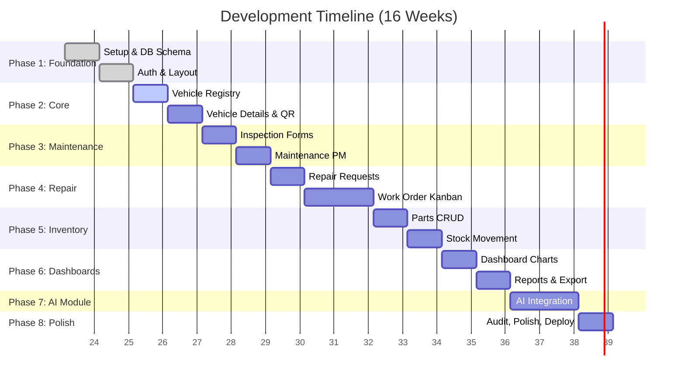

# 📅 Development Phases & Timeline

## Smart Army Vehicle Maintenance Dashboard

แผนการพัฒนา (Development Roadmap) แบ่งออกเป็น 8 เฟส ครอบคลุมเวลาประมาณ 16 สัปดาห์ (4 เดือน)

---

## 1. Gantt Chart (ตารางเวลาภาพรวม)

---

## 2. รายละเอียดแต่ละเฟส

### Phase 1: Foundation (Week 1-2)
**ระยะเวลา:** 2 สัปดาห์ | **Estimated:** 80 ชั่วโมง
- Setup Next.js, Tailwind, shadcn/ui
- ออกแบบ Prisma Schema & Database Setup
- ระบบ Authentication (NextAuth) และ Login Page
- สร้าง Layout (Sidebar, Header) และ Role-Based Access
- **Deliverables:** โครงโปรเจกต์พร้อมใช้งาน, เข้าสู่ระบบได้, หน้าต่าง Layout สมบูรณ์

### Phase 2: Core Vehicle Management (Week 3-4)
**ระยะเวลา:** 2 สัปดาห์ | **Estimated:** 80 ชั่วโมง
- สร้าง CRUD สำหรับประเภทยานพาหนะ
- ระบบลงทะเบียนยานพาหนะ (List, Create, Update, Delete)
- หน้า Vehicle Detail (รายละเอียด, ประวัติ, อัปเดตเลขไมล์)
- ระบบสร้าง QR Code ประจำรถ
- **Deliverables:** จัดการรถได้สมบูรณ์, สแกน QR ได้

### Phase 3: Maintenance & Inspection (Week 5-6)
**ระยะเวลา:** 2 สัปดาห์ | **Estimated:** 80 ชั่วโมง
- ระบบแบบฟอร์มตรวจสภาพรถ (Checklist) รองรับ Mobile
- ฟีเจอร์สร้างใบแจ้งซ่อมจากตรวจสภาพ (กรณีไม่ผ่าน)
- ระบบ Maintenance Plan และ Schedule
- ระบบคำนวณ Due Date ของการซ่อมบำรุง
- **Deliverables:** ตรวจสภาพรถได้, รถมีรอบการซ่อมบำรุง (PM)

### Phase 4: Repair & Work Order (Week 7-9)
**ระยะเวลา:** 3 สัปดาห์ | **Estimated:** 120 ชั่วโมง
- ระบบใบแจ้งซ่อม (Repair Request) และการอนุมัติ
- ระบบใบงานซ่อม (Work Order)
- Kanban Board สำหรับ Work Order (ลากวางสถานะได้)
- การมอบหมายช่าง และ Workflow งานซ่อม
- **Deliverables:** ช่างสามารถรับงานและบันทึกผลการซ่อมได้ตั้งแต่ต้นจนจบ

### Phase 5: Parts & Inventory (Week 10-11)
**ระยะเวลา:** 2 สัปดาห์ | **Estimated:** 80 ชั่วโมง
- CRUD สำหรับคลังอะไหล่ (Parts Inventory)
- ระบบรับเข้า (Stock In) / เบิกออก (Stock Out)
- เชื่อมต่อการเบิกอะไหล่เข้ากับ Work Order
- แจ้งเตือนอะไหล่ใกล้หมด (Low Stock)
- **Deliverables:** ตัดสต็อกอะไหล่ได้เมื่อมีการซ่อมจริง

### Phase 6: Dashboard & Reports (Week 12-13)
**ระยะเวลา:** 2 สัปดาห์ | **Estimated:** 80 ชั่วโมง
- หน้า Dashboard ภาพรวมพร้อม Summary Cards
- กราฟ Recharts (สถานะรถ, ค่าใช้จ่าย, ฯลฯ)
- ระบบ Reports พร้อมตัวกรองข้อมูล
- ระบบ Export เอกสาร (PDF, Excel, CSV)
- **Deliverables:** ผู้บริหารสามารถดูรายงานสรุปและ Export ข้อมูลได้

### Phase 7: AI Module (Week 14-15)
**ระยะเวลา:** 2 สัปดาห์ | **Estimated:** 80 ชั่วโมง
- ติดตั้งและเชื่อมต่อ Ollama (Gemma model) ผ่าน API
- AI สรุปประวัติการซ่อมรถ (AI-01)
- AI วิเคราะห์อาการเสียและแนะนำ (AI-02)
- AI สร้างรายงานสรุปประจำเดือน (AI-03)
- การจัดการ Fallback กรณี AI ล่ม (AI-04)
- **Deliverables:** ระบบมีฟีเจอร์ AI ครบตาม Requirement โดยไม่กระทบ Core System

### Phase 8: Polish & Deploy (Week 16)
**ระยะเวลา:** 1 สัปดาห์ | **Estimated:** 40 ชั่วโมง
- พัฒนาระบบ Audit Log บันทึกการทำงาน
- ทดสอบ Mobile Responsiveness อย่างละเอียด
- Performance & Security Review
- นำระบบขึ้น Production (Vercel + Supabase)
- **Deliverables:** ระบบพร้อมใช้งานบน Production Environment
